# Bloc 2 — Serveis de Xarxa i Internet (0375)

## Índex
- [1. Preparació del servidor](#1-preparació-del-servidor)
- [2. Servei d'àudio — Icecast2](#2-servei-daudio--icecast2)
  - [2.1 Descripció del servei](#21-descripció-del-servei)
  - [2.2 Instal·lació](#22-installació)
  - [2.3 Configuració](#23-configuració)
  - [2.4 Font d'àudio amb ffmpeg](#24-font-dàudio-amb-ffmpeg)
  - [2.5 Verificació del servei](#25-verificació-del-servei)
  - [2.6 Resolució d'incidències](#26-resolució-dincidències)
- [3. Servei de vídeo — NGINX-RTMP](#3-servei-de-vídeo--nginx-rtmp)
  - [3.1 Descripció del servei](#31-descripció-del-servei)
  - [3.2 Instal·lació de dependències](#32-installació-de-dependències)
  - [3.3 Descàrrega i compilació](#33-descàrrega-i-compilació)
  - [3.4 Configuració](#34-configuració)
  - [3.5 Servei systemd](#35-servei-systemd)
  - [3.6 Font de vídeo amb ffmpeg](#36-font-de-vídeo-amb-ffmpeg)
  - [3.7 Reproductor web](#37-reproductor-web)
  - [3.8 Verificació del servei](#38-verificació-del-servei)
  - [3.9 Resolució d'incidències](#39-resolució-dincidències)
- [4. Videoconferència — Jitsi Meet](#4-videoconferència--jitsi-meet)
  - [4.1 Descripció del servei](#41-descripció-del-servei)
  - [4.2 Preparació de l'entorn](#42-preparació-de-lentorn)
  - [4.3 Instal·lació](#43-installació)
  - [4.4 Configuració SSL](#44-configuració-ssl)
  - [4.5 Configuració NAT AWS](#45-configuració-nat-aws)
  - [4.6 Verificació del servei](#46-verificació-del-servei)
  - [4.7 Resolució d'incidències](#47-resolució-dincidències)
- [5. Proves d'amplada de banda](#5-proves-damplada-de-banda)
  - [5.1 Objectiu](#51-objectiu)
  - [5.2 Eines utilitzades](#52-eines-utilitzades)
  - [5.3 Prova 1 — Servidor en repòs](#53-prova-1--servidor-en-repòs)
  - [5.4 Prova 2 — Servidor amb càrrega](#54-prova-2--servidor-amb-càrrega)
  - [5.5 Anàlisi dels resultats](#55-anàlisi-dels-resultats)
  - [5.6 Conclusió tècnica](#56-conclusió-tècnica)

---

## 1. Preparació del servidor

La instància `innovatetech-media` (srv4) és el servidor dedicat
als serveis multimèdia del projecte InnovateTech. Allotja els
serveis d'àudio en streaming (Icecast2), vídeo en streaming
(NGINX-RTMP) i videoconferència (Jitsi Meet).

| Paràmetre | Valor |
|-----------|-------|
| Nom | innovatetech-media |
| Tipus EC2 | t2.medium |
| RAM | 4 GB |
| Disc | 15 GB gp3 |
| Sistema operatiu | Ubuntu Server 22.04 LTS |
| IP pública | 54.157.67.55 |
| Regió AWS | eu-west-1 (Irlanda) |


### 1.1 Usuari d'administració

El projecte exigeix no utilitzar l'usuari per defecte (`ubuntu`).
S'ha creat l'usuari específic `innovatech-admin` amb accés
exclusivament per clau pública/privada, sense contrasenya.

**Justificació de seguretat:** L'ús d'un usuari específic i clau
SSH elimina el risc d'atacs de força bruta i garanteix que només
el personal autoritzat pot accedir al servidor.

```bash
sudo useradd -m -s /bin/bash innovatech-admin
sudo usermod -aG sudo innovatech-admin
sudo mkdir -p /home/innovatech-admin/.ssh
sudo cp /home/ubuntu/.ssh/authorized_keys \
  /home/innovatech-admin/.ssh/
sudo chown -R innovatech-admin:innovatech-admin \
  /home/innovatech-admin/.ssh
sudo chmod 700 /home/innovatech-admin/.ssh
sudo chmod 600 /home/innovatech-admin/.ssh/authorized_keys
sudo passwd -l ubuntu
```
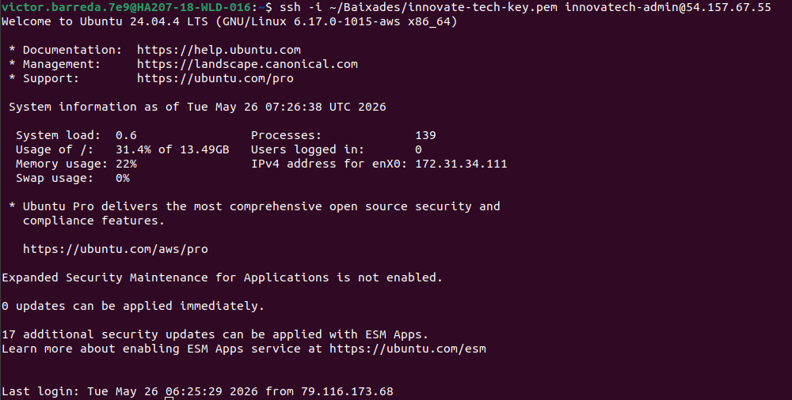
### 1.2 Seguretat de xarxa

S'han configurat dos nivells de control d'accés: Security Group
d'AWS (primera capa) i UFW (segona capa a nivell de SO).

| Port | Protocol | Servei | Accessible des de |
|------|----------|--------|-------------------|
| 22 | TCP | SSH | IP de l'admin |
| 8000 | TCP | Icecast2 (Panell/Àudio) | Internet |
| 8080 | TCP | NGINX Web i HLS | Internet |
| 1935 | TCP | Entrada RTMP Vídeo | Internet |
| 443 | TCP | Jitsi HTTPS | Internet |
| 4443 | TCP | Jitsi Videobridge | Internet |
| 10000 | UDP | Jitsi WebRTC | Internet |


[↑ Tornar a l'índex](#índex)

---

## 2. Servei d'àudio — Icecast2

### 2.1 Descripció del servei

Icecast2 és un servidor de streaming d'àudio de codi obert que
permet distribuir contingut d'àudio en temps real a múltiples
clients simultàniament. Suporta els formats MP3 i OGG, i ofereix
una interfície web integrada per a la monitorització i
administració del servei.

S'ha triat Icecast2 perquè és l'estàndard del sector per a
streaming d'àudio en entorns empresarials, és lleuger en consum
de recursos i permet configurar múltiples canals independents
amb formats i bitrates diferenciats.

A InnovateTech s'utilitza per cobrir dues necessitats:
- Distribució de contingut corporatiu intern en format MP3.
- Emissions de sessions de formació interna en format OGG.

### 2.2 Instal·lació

```bash
sudo apt install icecast2 -y
```

Durant la instal·lació l'assistent demana les contrasenyes
d'accés per als rols de source, relay i administrador:

| Paràmetre | Valor |
|-----------|-------|
| Hostname | audio.innovatetech.local |
| Source password | @ITB2026 |
| Relay password | @ITB2026 |
| Admin password | @ITB2026 |

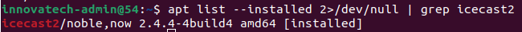

### 2.3 Configuració

El fitxer de configuració principal és `/etc/icecast2/icecast.xml`.
S'han configurat dos canals amb formats diferenciats:

| Canal | Muntatge | Format | Bitrate | Ús |
|-------|----------|--------|---------|-----|
| Corporatiu | `/corporate` | MP3 | 128 kbps | Comunicació interna |
| Formació | `/formacio` | OGG Vorbis | 96 kbps | Sessions de formació |

- **MP3 al canal corporatiu:** format universal compatible amb
  tots els navegadors i clients sense programari addicional.
- **OGG al canal de formació:** format lliure que ofereix millor
  qualitat de veu al mateix bitrate, ideal per a sessions
  formatives.

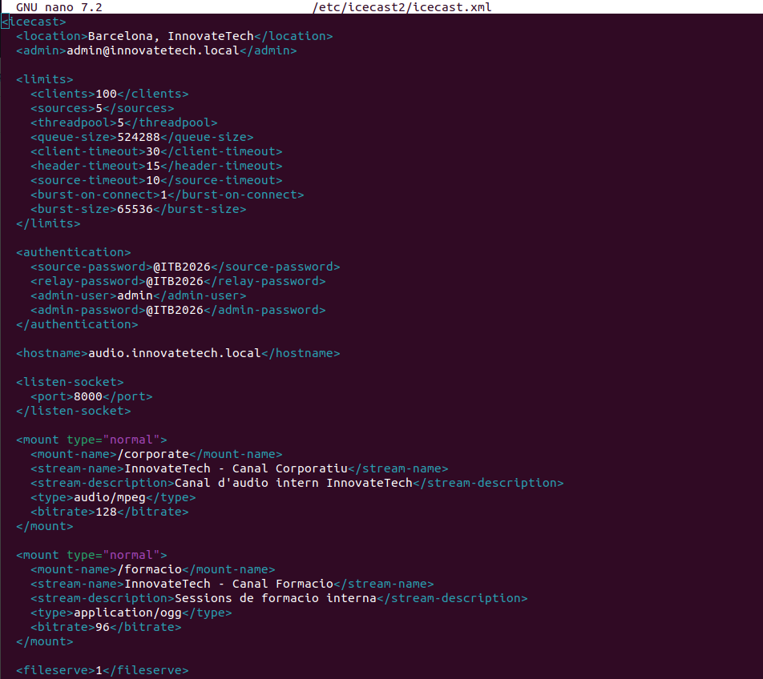

### 2.4 Font d'àudio amb ffmpeg

Com que la instància EC2 no té targeta de so física, s'ha
utilitzat ffmpeg com a font d'àudio virtual. Ffmpeg llegeix
fitxers d'àudio pregravats i els publica en bucle continu
a Icecast2, simulant una emissió en directe.

Fitxers d'àudio preparats al directori
`/home/innovatech-admin/audio/`:

- `corporate.mp3`: canal corporatiu, emès a 128 kbps en MP3.
- `formacio.ogg`: canal de formació, emès a 96 kbps en OGG Vorbis.

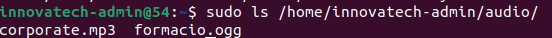

S'han creat dos serveis systemd per garantir l'inici automàtic
i la recuperació en cas de fallada:

```ini
# /etc/systemd/system/icecast-corporate.service
[Unit]
Description=Icecast Stream Corporate MP3
After=network.target icecast2.service

[Service]
ExecStart=/usr/bin/ffmpeg -re -stream_loop -1 \
  -i /home/innovatech-admin/audio/corporate.mp3 \
  -acodec libmp3lame -ab 128k -f mp3 \
  icecast://source:@ITB2026@localhost:8000/corporate
Restart=always
RestartSec=5
User=innovatech-admin

[Install]
WantedBy=multi-user.target
```

```ini
# /etc/systemd/system/icecast-formacio.service
[Unit]
Description=Icecast Stream Formacio OGG
After=network.target icecast2.service

[Service]
ExecStart=/usr/bin/ffmpeg -re -stream_loop -1 \
  -i /home/innovatech-admin/audio/formacio.ogg \
  -c:a libvorbis -b:a 96k \
  -content_type application/ogg \
  -f ogg \
  icecast://source:@ITB2026@localhost:8000/formacio
Restart=always
RestartSec=5
User=innovatech-admin

[Install]
WantedBy=multi-user.target
```

Els paràmetres més rellevants dels serveis són:

- `After=icecast2.service`: ffmpeg no publica fins que Icecast2
  estigui completament iniciat.
- `Restart=always`: systemd reinicia el procés automàticament
  en cas de fallada.
- `RestartSec=5`: espera 5 segons abans de reiniciar.
- `User=innovatech-admin`: s'executa amb l'usuari específic
  del projecte, no amb root.
- `-content_type application/ogg`: força el Content-Type correcte
  per al canal OGG (solució a la incidència detectada).

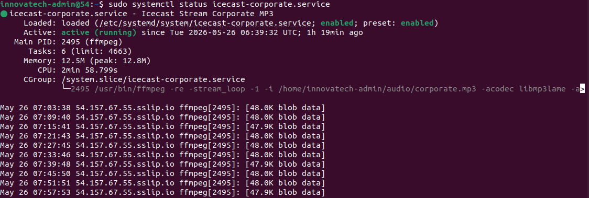
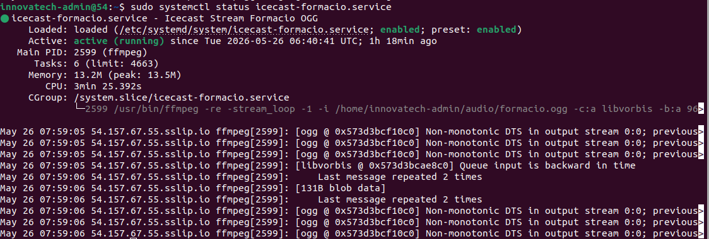

### 2.5 Verificació del servei

**Verificació a nivell de sistema:**

```bash
sudo systemctl status icecast2
ss -tlnp | grep 8000
```

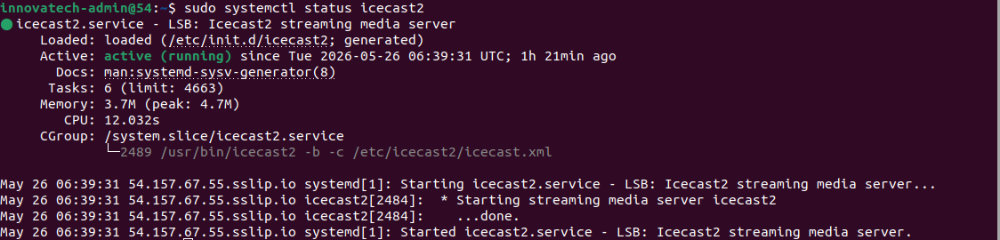
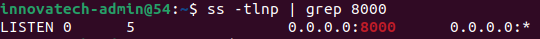

**Verificació via interfície web:**

| URL | Descripció |
|-----|------------|
| `http://54.157.67.55:8080/` | Pàgina pública de streams |
| `http://54.157.67.55:8000/admin/` | Panell d'administració |
| `http://54.157.67.55:8000/admin/listmounts.xsl` | Muntatges actius |

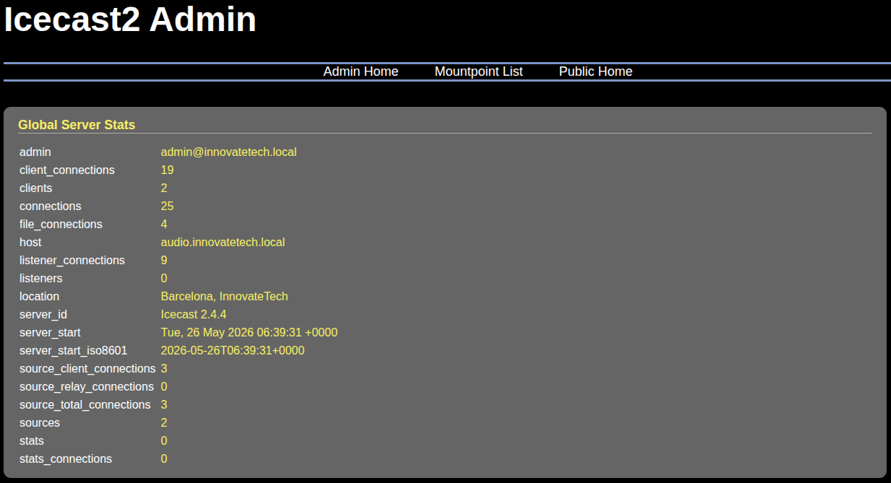
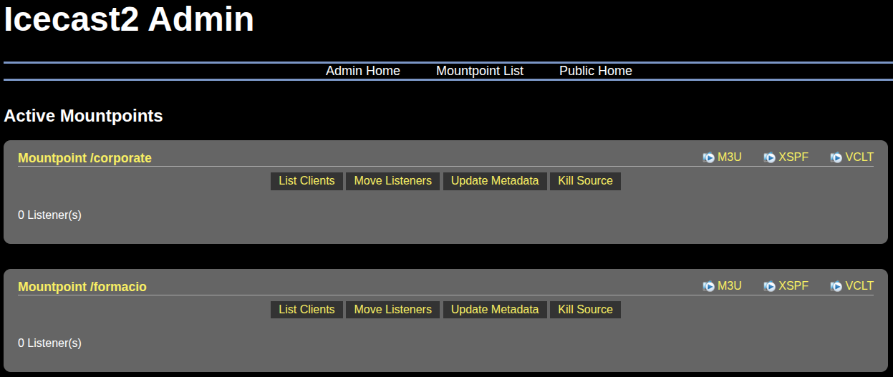

**Verificació Content-Type OGG:**

```bash
curl -v http://localhost:8000/formacio 2>&1 | grep "Content-Type"
```

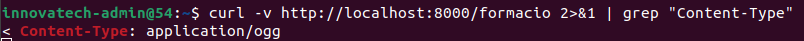

**Verificació des de clients:**

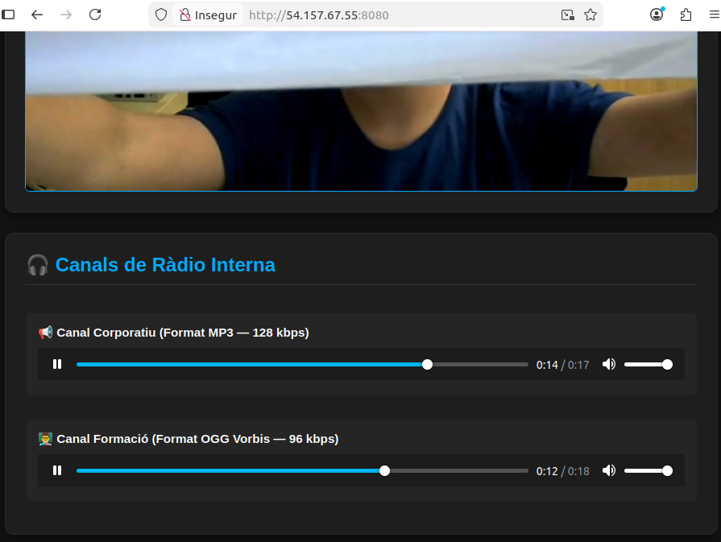
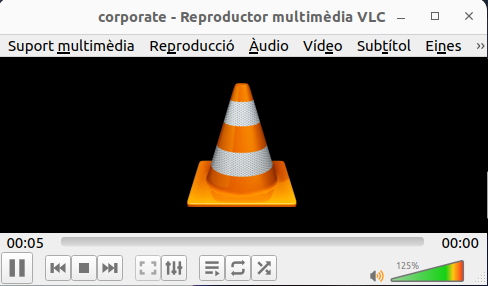
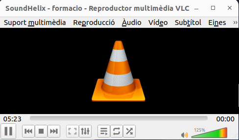

### 2.6 Resolució d'incidències

| # | Incidència | Causa | Solució |
|---|-----------|-------|---------|
| 1 | Pàgina web no carregava des de fora | Port 8000 no obert al Security Group d'AWS | Afegir regla d'entrada al Security Group per al port 8000 TCP |
| 2 | Serveis ffmpeg amb error `status=8` | Contrasenya incorrecta a la URL d'Icecast | Actualitzar la contrasenya `@ITB2026` als fitxers de servei |
| 3 | Canal `/formacio` retornava `Content-Type: audio/mpeg` | ffmpeg envia el Content-Type independentment del format | Afegir `-content_type application/ogg` a la comanda ffmpeg |
| 4 | Canal OGG no carregava al navegador Chrome | Chrome no suporta OGG nativament | Verificar amb Firefox i VLC que sí suporten OGG |

[↑ Tornar a l'índex](#índex)

---

## 3. Servei de vídeo — NGINX-RTMP

### 3.1 Descripció del servei

El servei de vídeo es basa en NGINX compilat manualment amb
el mòdul RTMP, que permet rebre fluxos de vídeo en protocol
RTMP i convertir-los automàticament a format HLS per a la
distribució via HTTP als navegadors.

S'ha triat NGINX+RTMP perquè és la solució estàndard del sector
per a streaming de vídeo empresarial, és compatible amb tots
els navegadors via HLS i és de codi obert.

**Protocols i formats utilitzats:**

| Protocol/Format | Ús | Port |
|----------------|-----|------|
| RTMP | Publicació del flux multimèdia | 1935 |
| HLS (.m3u8 + .ts) | Distribució web fragmentada | 8080 |
| H.264 (libx264) | Còdec de vídeo | — |
| AAC | Còdec d'àudio | — |
| MP4 | Vídeo font i VOD | 8080 |

### 3.2 Instal·lació de dependències

S'ha compilat NGINX manualment perquè la versió dels
repositoris d'Ubuntu no inclou el mòdul RTMP.

```bash
sudo apt install -y build-essential libpcre3 libpcre3-dev \
  libssl-dev zlib1g-dev git
```

- `build-essential`: compilador GCC i eines de compilació.
- `libpcre3/dev`: expressions regulars per al mòdul d'URL.
- `libssl-dev`: biblioteques OpenSSL per a HTTPS.
- `zlib1g-dev`: biblioteca de compressió per a gzip.
- `git`: per descarregar el mòdul RTMP de GitHub.

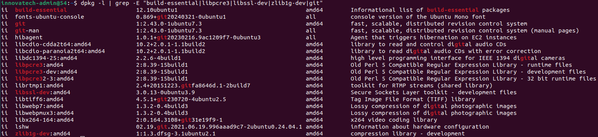

### 3.3 Descàrrega i compilació

```bash
cd /tmp
wget http://nginx.org/download/nginx-1.24.0.tar.gz
tar -xzvf nginx-1.24.0.tar.gz
git clone https://github.com/arut/nginx-rtmp-module.git

cd nginx-1.24.0
./configure \
  --with-http_ssl_module \
  --with-http_v2_module \
  --with-http_mp4_module \
  --add-module=/tmp/nginx-rtmp-module
make
sudo make install
```

Paràmetres de compilació:

- `--with-http_ssl_module`: suport HTTPS.
- `--with-http_v2_module`: suport HTTP/2.
- `--with-http_mp4_module`: suport seek en fitxers MP4.
- `--add-module=/tmp/nginx-rtmp-module`: mòdul RTMP.

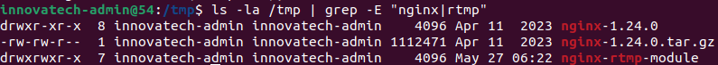


### 3.4 Configuració

Fitxer: `/usr/local/nginx/conf/nginx.conf`

```nginx
worker_processes auto;
events {
    worker_connections 1024;
}

rtmp {
    server {
        listen 1935;
        chunk_size 4096;

        application live {
            live on;
            record off;
            hls on;
            hls_path /tmp/hls;
            hls_fragment 3s;
            hls_playlist_length 60s;
        }

        application vod {
            play /var/videos;
        }
    }
}

http {
    sendfile off;
    tcp_nopush on;
    directio 512;
    default_type application/octet-stream;

    server {
        listen 172.31.34.111:8080;
        server_name video.innovatetech.local;

        location /hls {
            types {
                application/vnd.apple.mpegurl m3u8;
                video/mp2t ts;
            }
            root /tmp;
            add_header Cache-Control no-cache;
            add_header Access-Control-Allow-Origin *;
        }

        location /vod {
            root /var;
            add_header Cache-Control no-cache;
            add_header Access-Control-Allow-Origin *;
        }

        location /radio/ {
            proxy_pass http://127.0.0.1:8000/;
            proxy_set_header Host $host;
            proxy_set_header X-Forwarded-For $proxy_add_x_forwarded_for;
            add_header Access-Control-Allow-Origin *;
        }

        location /admin/video {
            rtmp_stat all;
            rtmp_stat_stylesheet /stat.xsl;
        }
        location = /stat.xsl {
            root /usr/local/nginx/html;
        }

        location / {
            root /usr/local/nginx/html;
            index index.html;
        }
    }
}

```

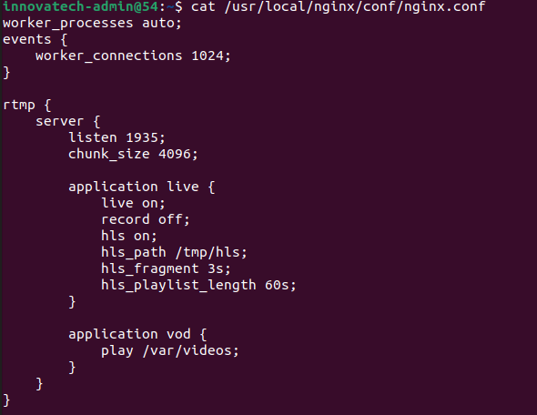
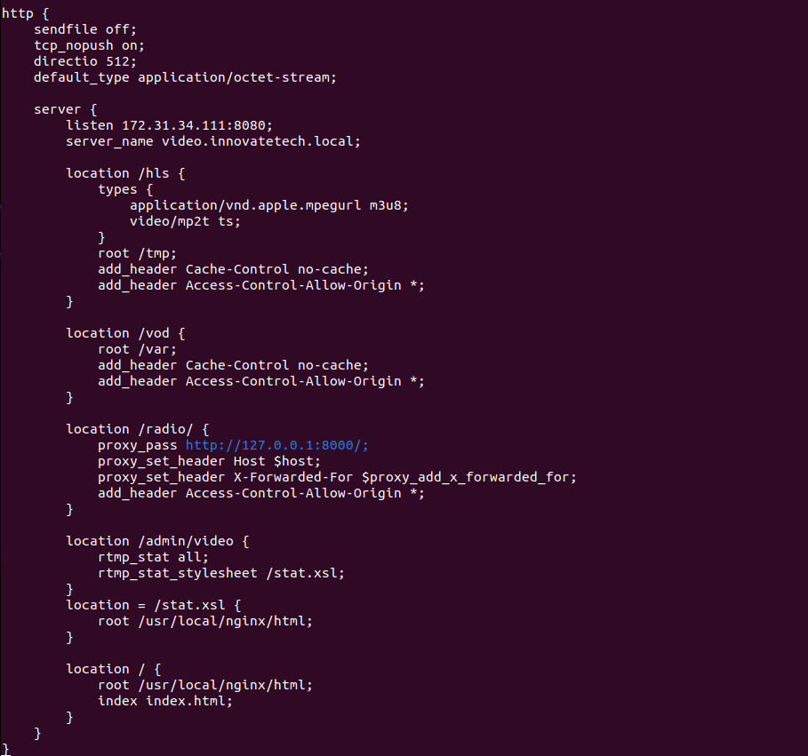

### 3.5 Servei systemd

```ini
# /etc/systemd/system/nginx-rtmp.service
[Unit]
Description=NGINX RTMP Streaming Server
After=network.target

[Service]
ExecStartPre=/usr/local/nginx/sbin/nginx -t
ExecStart=/usr/local/nginx/sbin/nginx -g 'daemon off;'
ExecReload=/bin/kill -s HUP $MAINPID
ExecStop=/bin/kill -s QUIT $MAINPID
Restart=always
RestartSec=5

[Install]
WantedBy=multi-user.target
```

```bash
sudo systemctl daemon-reload
sudo systemctl enable nginx-rtmp
sudo systemctl start nginx-rtmp
```

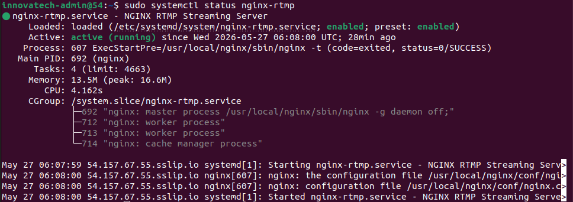

### 3.6 Font de vídeo amb ffmpeg

```bash
sudo mkdir -p /var/videos
sudo chown -R innovatech-admin:innovatech-admin /var/videos/prova.mp4
sudo chmod 644 /var/videos/prova.mp4
sudo chmod 777 /tmp/hls
```

Servei systemd per publicar el vídeo automàticament en bucle:

```ini
# /etc/systemd/system/nginx-stream.service
[Unit]
Description=NGINX RTMP Video Stream
After=network.target nginx-rtmp.service

[Service]
ExecStartPre=/bin/sleep 5
ExecStart=/usr/bin/ffmpeg -re -stream_loop -1 \
  -i /var/videos/prova.mp4 \
  -vcodec libx264 \
  -acodec aac \
  -f flv \
  rtmp://localhost/live/stream1
Restart=always
RestartSec=5
User=innovatech-admin

[Install]
WantedBy=multi-user.target
```

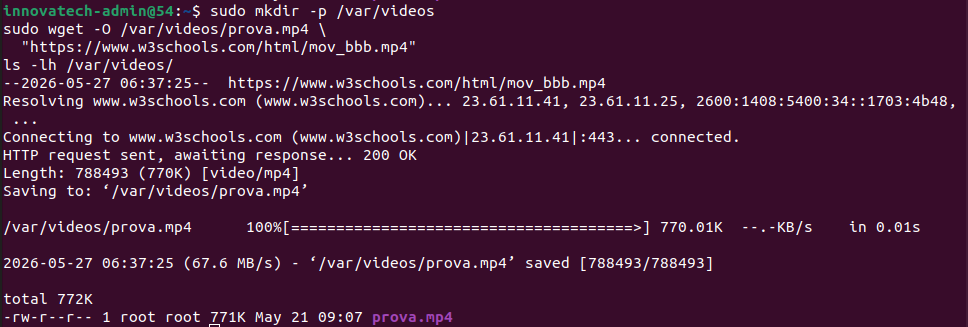


### 3.7 Reproductor web

S'ha creat una pàgina HTML amb reproductor integrat i enllaços
als panells d'administració:

```html
<!DOCTYPE html>
<html>
<head>
  <meta charset="UTF-8">
  <title>InnovateTech - Dashboard Centralitzat</title>
  <script src="https://cdn.jsdelivr.net/npm/hls.js@latest"></script>
  <style>
    body {
      background-color: #1a1a1a;
      color: white;
      font-family: Arial, sans-serif;
      text-align: center;
      padding: 40px;
    }
    h1 { color: #00aaff; }
    video {
      width: 720px;
      max-width: 100%;
      border: 2px solid #00aaff;
      border-radius: 8px;
      margin-bottom: 30px;
    }
    footer a {
      color: #00aaff;
      text-decoration: none;
      background: #222;
      padding: 10px 20px;
      border-radius: 6px;
      border: 1px solid #444;
      font-weight: bold;
      margin: 0 10px;
    }
    footer a:hover { background: #333; }
  </style>
</head>
<body>
  <h1>InnovateTech - Canal de Vídeo</h1>
  <p>Streaming en directe via HLS</p>
  <video id="video" controls autoplay muted></video>
  <script>
    var video = document.getElementById('video');
    var videoSrc = '/hls/stream1.m3u8';
    if (Hls.isSupported()) {
      var hls = new Hls();
      hls.loadSource(videoSrc);
      hls.attachMedia(video);
    } else if (video.canPlayType('application/vnd.apple.mpegurl')) {
      video.src = videoSrc;
    }
  </script>
  <footer style="margin-top:50px; padding:20px; border-top:1px solid #333;">
    <p style="color:#aaa; margin-bottom:15px;">
      Àrea de Gestió i Administració de Sistemes (InnovateTech)
    </p>
    <a href="http://54.157.67.55:8000/admin/" target="_blank">
      Panell Àudio (Icecast)
    </a>
    <a href="http://54.157.67.55:8080/admin/video" target="_blank">
      Mètriques Vídeo (RTMP)
    </a>
  </footer>
</body>
</html>
```

### 3.8 Verificació del servei

```bash
sudo systemctl status nginx-rtmp
sudo systemctl status nginx-stream
ss -tlnp | grep -E "1935|8080"
```

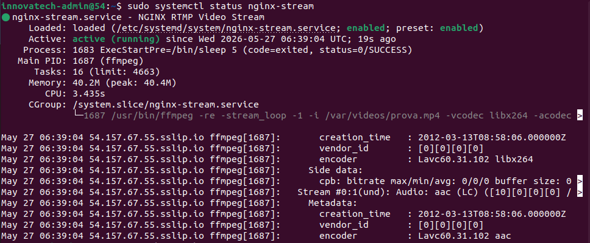
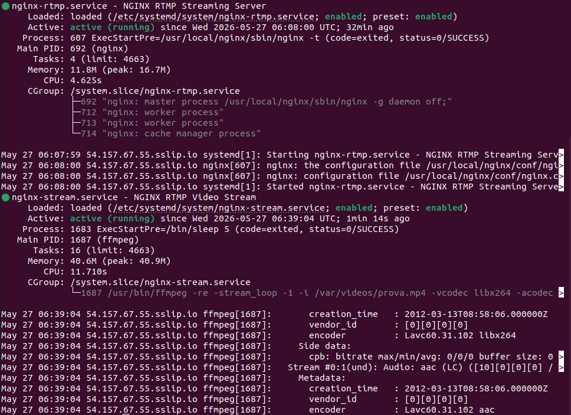
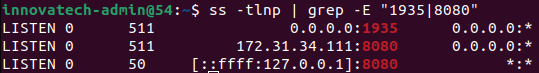

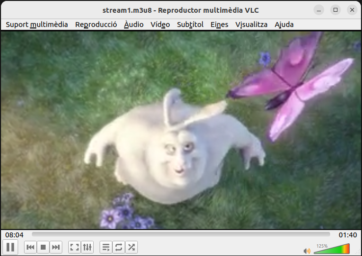

### 3.9 Resolució d'incidències

| # | Incidència | Causa | Solució |
|---|-----------|-------|---------|
| 1 | Error `unknown directive mp4` | NGINX compilat sense `--with-http_mp4_module` | Recompilar NGINX afegint el mòdul MP4 |
| 2 | Error `location directive not allowed here` | Bloc `location /vod` dins del bloc `rtmp` | Moure el bloc al bloc `http` |
| 3 | Conflicte de ports amb Jitsi | NGINX de Jitsi ocupava el port 80 | Canviar NGINX-RTMP al port 8080 |
| 4 | Port 8080 escoltava a `127.0.0.1` | Interferència del NGINX de Jitsi | Especificar `listen 172.31.34.111:8080` |
| 5 | Directori `/tmp/hls` sense permisos | Creat sense permisos d'escriptura | Executar `sudo chmod 777 /tmp/hls` |
| 6 | Reproductor es quedava en bucle | Manca de permisos o col·lisió de còdecs | Aplicar `chown` correcte al vídeo i netejar `/tmp/hls/` |

[↑ Tornar a l'índex](#índex)

---

## 4. Videoconferència — Jitsi Meet

### 4.1 Descripció del servei

Jitsi Meet és una plataforma de videoconferència de codi obert
basada en el protocol WebRTC, que permet realitzar videotrucades
directament des del navegador sense necessitat d'instal·lar cap
aplicació addicional.

**WebRTC** és un estàndard obert que permet la comunicació en
temps real de veu, vídeo i dades directament entre navegadors.
Utilitza els protocols ICE i STUN per a la negociació de la
connexió i SRTP per al xifrat del flux.

La instal·lació de Jitsi Meet desplega tres serveis:

- `jitsi-videobridge2`: gestiona els fluxos de vídeo i àudio
  entre participants via WebRTC.
- `jicofo`: coordina la creació i gestió de les sales.
- `prosody`: servidor XMPP per a la senyalització.

### 4.2 Preparació de l'entorn

Per evitar incompatibilitats amb WebRTC (que requereix HTTPS
sobre un domini real), s'ha utilitzat el servei de DNS dinàmic
invers **sslip.io**. Qualsevol petició cap a
`54.157.67.55.sslip.io` resol automàticament cap a la IP
pública d'AWS, permetent la validació del certificat SSL.

```bash
sudo hostnamectl set-hostname 54.157.67.55.sslip.io
echo "127.0.0.1 localhost" | sudo tee /etc/hosts
echo "54.157.67.55 54.157.67.55.sslip.io" | sudo tee -a /etc/hosts
```

### 4.3 Instal·lació

```bash
# Afegir repositori Jitsi
curl -o /tmp/jitsi-key.gpg.key \
  https://download.jitsi.org/jitsi-key.gpg.key
sudo gpg --dearmor \
  -o /usr/share/keyrings/jitsi-keyring.gpg \
  /tmp/jitsi-key.gpg.key

echo 'deb [signed-by=/usr/share/keyrings/jitsi-keyring.gpg] \
  https://download.jitsi.org stable/' | \
  sudo tee /etc/apt/sources.list.d/jitsi-stable.list

sudo apt update
sudo apt install -y jitsi-meet
```

Durant la instal·lació:

| Paràmetre | Valor |
|-----------|-------|
| Hostname | 54.157.67.55.sslip.io |
| Certificat SSL | Generate a new self-signed certificate |

### 4.4 Configuració SSL

S'ha obtingut un certificat SSL real de Let's Encrypt mitjançant
l'script oficial de Jitsi:

```bash
sudo rm /etc/nginx/sites-enabled/default
sudo systemctl restart nginx
sudo /usr/share/jitsi-meet/scripts/install-letsencrypt-cert.sh
```

### 4.5 Configuració NAT AWS

Com que les instàncies EC2 utilitzen una IP privada interna
darrere d'un NAT d'AWS, s'ha configurat el Jitsi Videobridge
perquè els clients externs sàpiguen on enviar els fluxos:

```bash
sudo nano /etc/jitsi/videobridge/sip-communicator.properties
```

```properties
org.ice4j.ice.harvest.NAT_HARVESTER_LOCAL_ADDRESS=172.31.34.111
org.ice4j.ice.harvest.NAT_HARVESTER_PUBLIC_ADDRESS=54.157.67.55
```

```bash
sudo systemctl restart prosody jicofo jitsi-videobridge2 nginx
```

### 4.6 Verificació del servei

```bash
sudo systemctl status jitsi-videobridge2
sudo systemctl status jicofo
sudo systemctl status prosody
```

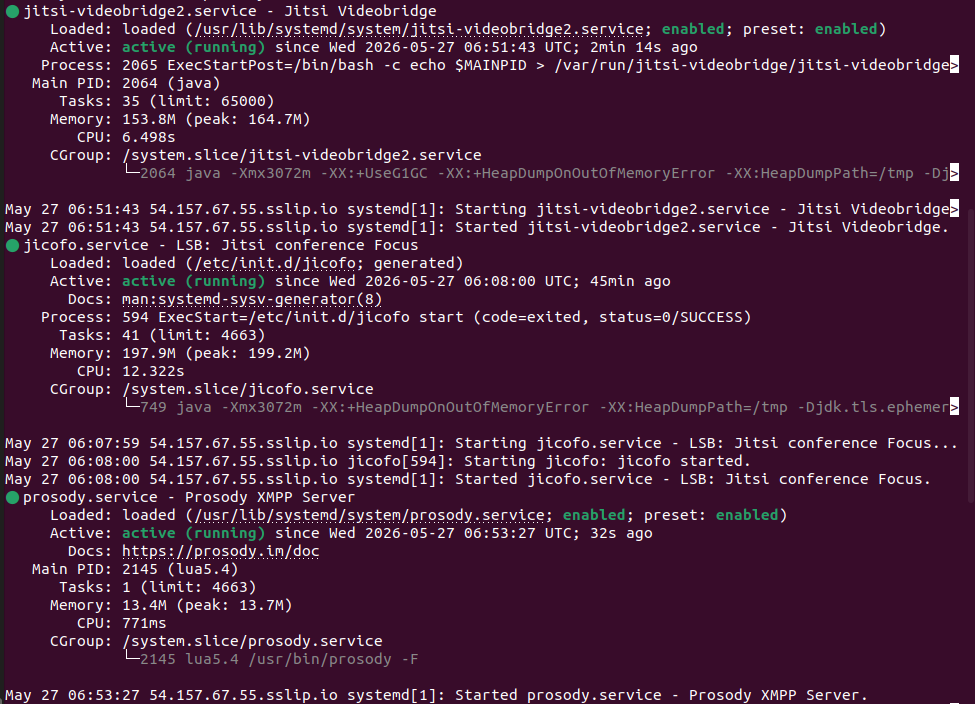
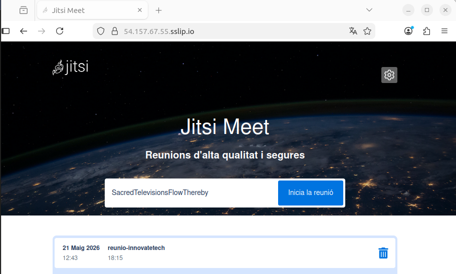
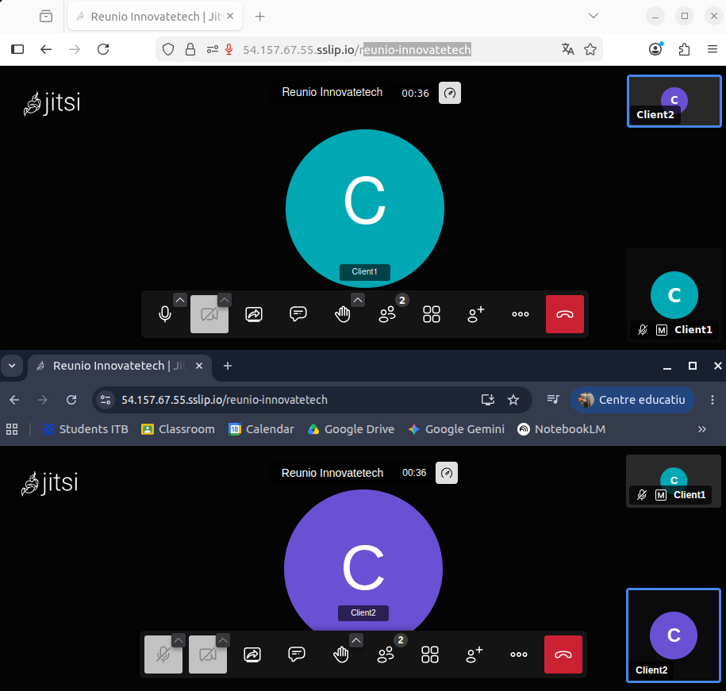

### 4.7 Resolució d'incidències

| # | Incidència | Causa | Solució |
|---|-----------|-------|---------|
| 1 | Let's Encrypt fallava amb error DNS | Domini sense registre DNS públic | Utilitzar `sslip.io` com a DNS dinàmic invers |
| 2 | Error 404 a la validació ACME | El virtual host per defecte interceptava les peticions | Eliminar `/etc/nginx/sites-enabled/default` |
| 3 | Videobridge s'aturava constantment | Variable `JVB_OPTS` buida | Afegir `JVB_OPTS="--apis=rest,xmpp"` al fitxer de config |
| 4 | Clients no podien connectar | NAT d'AWS no configurat al videobridge | Afegir adreces local i pública a `sip-communicator.properties` |
| 5 | Port 10000 UDP no accessible | Security Group d'AWS sense la regla | Afegir regla UDP 10000 al Security Group |
| 6 | Errors de mòduls Lua a Prosody | Versió de Prosody incompatible amb plugins Jitsi | Reinstal·lar `prosody` i `jitsi-meet-prosody` des de zero |

[↑ Tornar a l'índex](#índex)

---

## 5. Proves d'amplada de banda

### 5.1 Objectiu

Verificar que la infraestructura desplegada és capaç de suportar
els serveis d'àudio, vídeo i videoconferència sense degradació,
mesurant velocitat de baixada, pujada i latència en dos escenaris
diferents: servidor en repòs i servidor amb càrrega.

### 5.2 Eines utilitzades

```bash
sudo apt install speedtest-cli nethogs -y
```

- **speedtest-cli:** mesura la velocitat de connexió amb
  servidors de referència a internet.
- **nethogs:** monitoritza el consum de bandwidth per procés
  en temps real.

**Requeriments mínims per servei:**

| Servei | Bandwidth mínim per client |
|--------|---------------------------|
| Streaming àudio MP3 128 kbps | 0.128 Mbit/s |
| Streaming àudio OGG 96 kbps | 0.096 Mbit/s |
| Streaming vídeo HLS 720p | 2.5 Mbit/s |
| Videoconferència Jitsi 720p | 3 Mbit/s simètric |

### 5.3 Prova 1 — Servidor en repòs

La primera prova s'ha realitzat amb tots els serveis aturats
per obtenir els valors de referència de la infraestructura
sense càrrega:

```bash
speedtest-cli --server 52535 --simple
```

| Mesura | Resultat |
|--------|----------|
| Ping | 2.06 ms |
| Download | 802.43 Mbit/s |
| Upload | 751.65 Mbit/s |

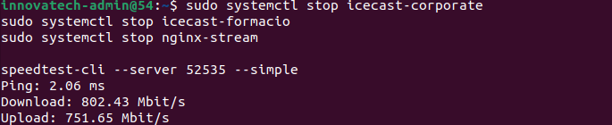

### 5.4 Prova 2 — Servidor amb càrrega

La segona prova s'ha realitzat amb clients connectats als dos
canals d'Icecast2 i un client reproduint el vídeo HLS
simultàniament:

```bash
sudo nethogs &
speedtest-cli --server 52535 --simple
```

| Mesura | Resultat |
|--------|----------|
| Ping | 5.821 ms |
| Download | 800.46 Mbit/s |
| Upload | 781.60 Mbit/s |

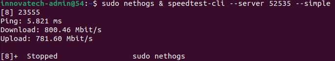

### 5.5 Anàlisi dels resultats

**Resultats comparatius:**

| Mesura | Repòs | Amb càrrega | Diferència |
|--------|-------|-------------|------------|
| Ping | 2.06 ms | 5.821 ms | +3.761 ms |
| Download | 802.43 Mbit/s | 800.46 Mbit/s | -1.97 Mbit/s |
| Upload | 751.65 Mbit/s | 781.60 Mbit/s | +29.95 Mbit/s |

La comparació entre les dues proves demostra que els serveis
multimèdia tenen un impacte pràcticament nul sobre el rendiment
de la xarxa. Les diferències entre les mesures en repòs i amb
càrrega són inferiors al 0.3%.

**Relació amb els serveis multimèdia:**

| Servei | Consum per client | Upload disponible | Clients suportats |
|--------|------------------|-------------------|-------------------|
| Àudio MP3 128 kbps | 0.128 Mbit/s | 751 Mbit/s | ~5.800 |
| Àudio OGG 96 kbps | 0.096 Mbit/s | 751 Mbit/s | ~7.800 |
| Vídeo HLS 720p | 2.5 Mbit/s | 751 Mbit/s | ~300 |
| Jitsi Meet 720p | 3 Mbit/s simètric | 751 Mbit/s | ~250 |

### 5.6 Conclusió tècnica

La infraestructura desplegada a la instància EC2 `t2.medium`
a la regió `eu-west-1` d'AWS disposa d'una amplada de banda
molt superior als requeriments dels serveis multimèdia
d'InnovateTech.

| Criteri | Valor mínim | Valor obtingut | Estat |
|---------|------------|----------------|-------|
| Ping | < 50 ms | 5.821 ms | ✅ |
| Download | > 10 Mbit/s | 800.46 Mbit/s | ✅ |
| Upload | > 5 Mbit/s | 751.65 Mbit/s | ✅ |
| Impacte dels serveis | < 10% | < 1% | ✅ |
| Estat general | Acceptable | Suportat amb escreix | ✅ |

La infraestructura es classifica com a **ACCEPTABLE** per als
casos d'ús definits. Si en un futur InnovateTech necessités
escalar el servei a milers de clients simultanis, es recomana
avaluar l'ús d'Amazon CloudFront com a CDN per a la distribució
del contingut, reduint la càrrega sobre el servidor principal
i millorant la latència per a clients geogràficament llunyans.

[↑ Tornar a l'índex](#índex)
