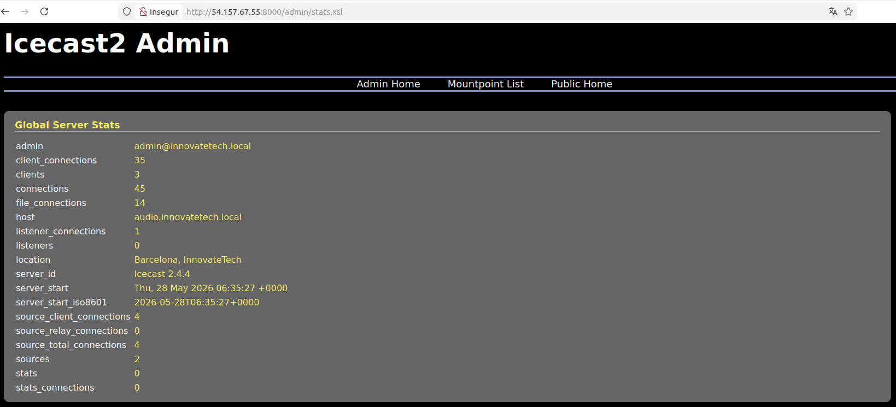
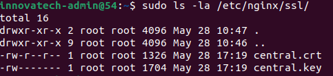
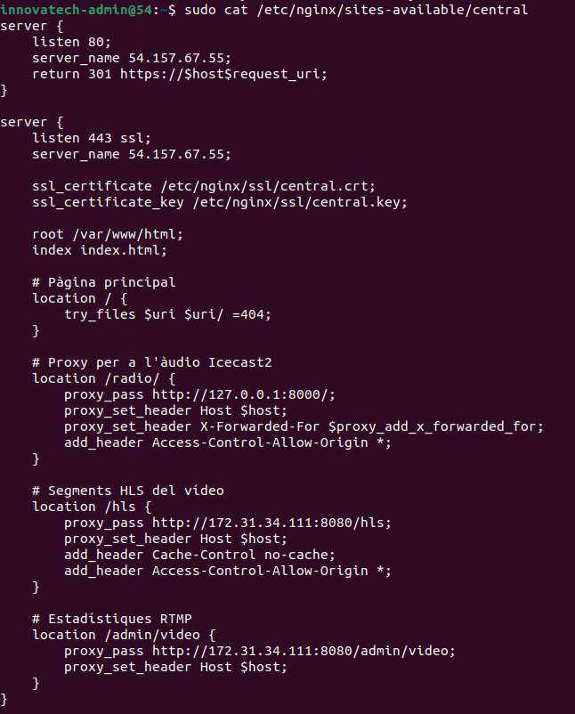
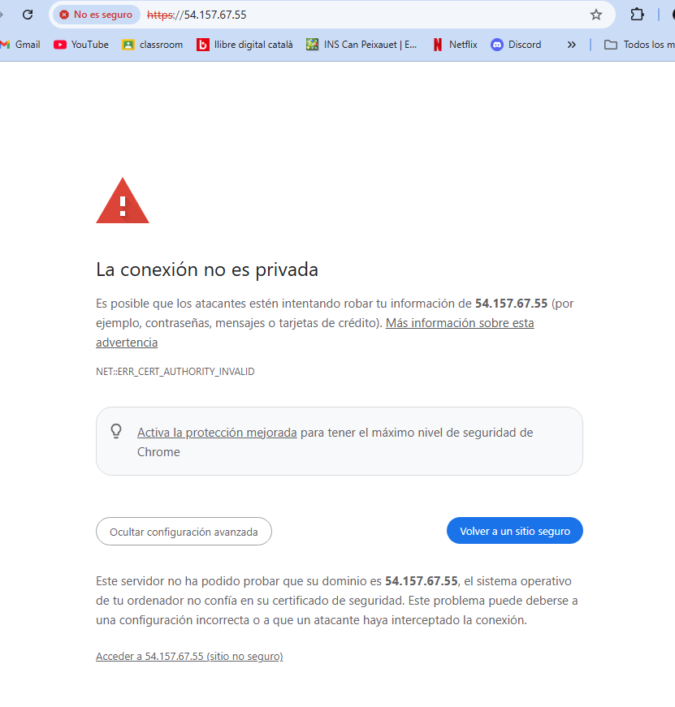
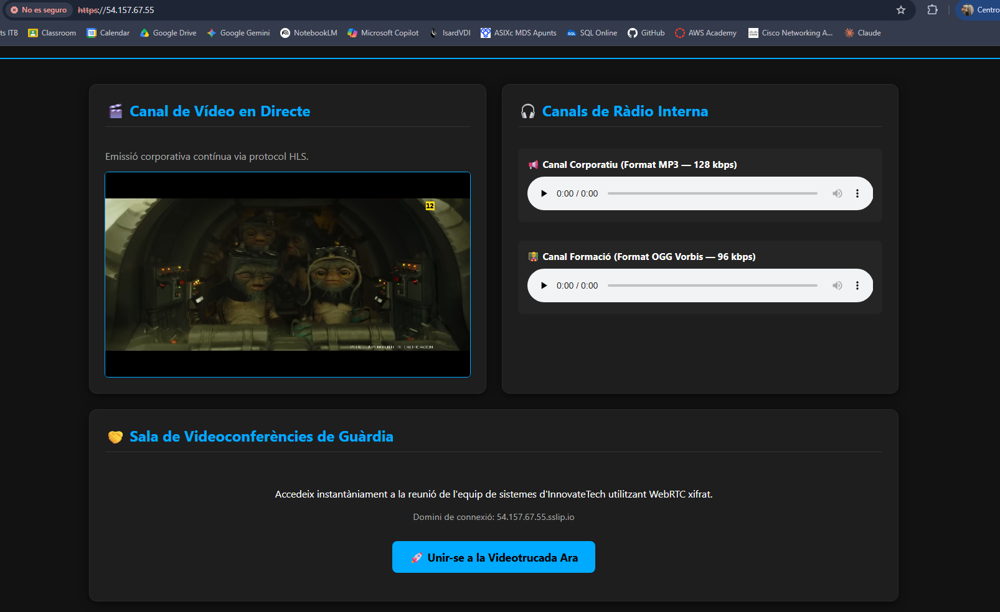

# Bloc 2 — Serveis de Xarxa i Internet (0375)

## Índex
- [1. Preparació del servidor](#1-preparació-del-servidor)
- [2. Servei d'àudio — Icecast2](#2-servei-daudio--icecast2)
  - [2.1 Descripció del servei](#21-descripció-del-servei)
  - [2.2 Instal·lació](#22-installació)
  - [2.3 Configuració](#23-configuració)
  - [2.4 Font d'àudio amb ffmpeg](#24-font-dàudio-amb-ffmpeg)
  - [2.5 Verificació del servei](#25-verificació-del-servei)
  - [2.6 Resolució d'incidències](#26-resolució-dincidències)
- [3. Servei de vídeo — NGINX-RTMP](#3-servei-de-vídeo--nginx-rtmp)
  - [3.1 Descripció del servei](#31-descripció-del-servei)
  - [3.2 Instal·lació de dependències](#32-installació-de-dependències)
  - [3.3 Descàrrega i compilació](#33-descàrrega-i-compilació)
  - [3.4 Configuració](#34-configuració)
  - [3.5 Servei systemd](#35-servei-systemd)
  - [3.6 Font de vídeo amb ffmpeg](#36-font-de-vídeo-amb-ffmpeg)
  - [3.7 Reproductor web i portal centralitzat](#37-reproductor-web-i-portal-centralitzat)
  - [3.8 Verificació del servei](#38-verificació-del-servei)
  - [3.9 Resolució d'incidències](#39-resolució-dincidències)
- [4. Videoconferència — Jitsi Meet](#4-videoconferència--jitsi-meet)
  - [4.1 Descripció del servei](#41-descripció-del-servei)
  - [4.2 Preparació de l'entorn](#42-preparació-de-lentorn)
  - [4.3 Instal·lació](#43-installació)
  - [4.4 Configuració SSL](#44-configuració-ssl)
  - [4.5 Configuració NAT AWS](#45-configuració-nat-aws)
  - [4.6 Verificació del servei](#46-verificació-del-servei)
  - [4.7 Resolució d'incidències](#47-resolució-dincidències)
- [5. Portal web centralitzat amb HTTPS](#5-portal-web-centralitzat-amb-https)
  - [5.1 Descripció](#51-descripció)
  - [5.2 Certificat autosignat](#52-certificat-autosignat)
  - [5.3 Configuració NGINX](#53-configuració-nginx)
  - [5.4 Verificació](#54-verificació)
  - [5.5 Resolució d'incidències](#55-resolució-dincidències)
- [6. Proves d'amplada de banda](#6-proves-damplada-de-banda)
  - [6.1 Objectiu](#61-objectiu)
  - [6.2 Eines utilitzades](#62-eines-utilitzades)
  - [6.3 Prova 1 — Servidor en repòs](#63-prova-1--servidor-en-repòs)
  - [6.4 Prova 2 — Servidor amb càrrega](#64-prova-2--servidor-amb-càrrega)
  - [6.5 Anàlisi dels resultats](#65-anàlisi-dels-resultats)
  - [6.6 Conclusió tècnica](#66-conclusió-tècnica)

---

## 1. Preparació del servidor

La instància `innovatetech-media` (srv4) és el servidor dedicat
als serveis multimèdia del projecte InnovateTech. Allotja els
serveis d'àudio en streaming (Icecast2), vídeo en streaming
(NGINX-RTMP) i videoconferència (Jitsi Meet), tots accessibles
des d'un portal web centralitzat amb HTTPS.

| Paràmetre | Valor |
|-----------|-------|
| Nom | innovatetech-media |
| Tipus EC2 | t2.medium |
| RAM | 4 GB |
| Disc | 15 GB gp3 |
| Sistema operatiu | Ubuntu Server 22.04 LTS |
| IP pública | 54.157.67.55 |
| Regió AWS | eu-west-1 (Irlanda) |


### 1.1 Usuari d'administració

El projecte exigeix no utilitzar l'usuari per defecte (`ubuntu`).
S'ha creat l'usuari específic `innovatech-admin` amb accés
exclusivament per clau pública/privada, sense contrasenya.

**Justificació de seguretat:** L'ús d'un usuari específic i clau
SSH elimina el risc d'atacs de força bruta i garanteix que només
el personal autoritzat pot accedir al servidor. Desactivar
l'usuari `ubuntu` per defecte impedeix qualsevol accés no
autoritzat amb credencials conegudes.

```bash
sudo useradd -m -s /bin/bash innovatech-admin
sudo usermod -aG sudo innovatech-admin
sudo mkdir -p /home/innovatech-admin/.ssh
sudo cp /home/ubuntu/.ssh/authorized_keys \
  /home/innovatech-admin/.ssh/
sudo chown -R innovatech-admin:innovatech-admin \
  /home/innovatech-admin/.ssh
sudo chmod 700 /home/innovatech-admin/.ssh
sudo chmod 600 /home/innovatech-admin/.ssh/authorized_keys
sudo passwd -l ubuntu
```


### 1.2 Seguretat de xarxa

S'han configurat dos nivells de control d'accés independents:

- **Security Group d'AWS:** primera capa de filtratge a nivell
  de xarxa virtual, abans que el tràfic arribi al servidor.
- **UFW (Uncomplicated Firewall):** segona capa a nivell del
  sistema operatiu, com a mesura de seguretat addicional.

Aquesta doble capa garanteix que fins i tot si el Security Group
es configurés incorrectament, el firewall del SO actuaria com
a salvaguarda.

| Port | Protocol | Servei | Accessible des de |
|------|----------|--------|-------------------|
| 22 | TCP | SSH | IP de l'admin |
| 80 | TCP | HTTP → redirecció HTTPS | Internet |
| 443 | TCP | HTTPS portal + Jitsi | Internet |
| 1935 | TCP | RTMP entrada vídeo | Internet |
| 4443 | TCP | Jitsi Videobridge | Internet |
| 8000 | TCP | Icecast2 àudio | Internet |
| 8080 | TCP | NGINX-RTMP HLS | Internet |
| 10000 | UDP | Jitsi WebRTC | Internet |


[↑ Tornar a l'índex](#índex)

---

## 2. Servei d'àudio — Icecast2

### 2.1 Descripció del servei

Icecast2 és un servidor de streaming d'àudio de codi obert que
permet distribuir contingut d'àudio en temps real a múltiples
clients simultàniament. Suporta els formats MP3 i OGG Vorbis,
i ofereix una interfície web integrada per a la monitorització
i administració del servei.

S'ha triat Icecast2 per les raons següents:
- És l'estàndard del sector per a streaming d'àudio en entorns
  empresarials.
- Consumeix molt pocs recursos (~3 MB de RAM en repòs).
- Permet configurar múltiples canals independents amb formats
  i bitrates diferenciats.
- Disposa d'autenticació integrada per als clients source.

A InnovateTech s'utilitza per cobrir dues necessitats:
- Distribució de contingut corporatiu intern en format MP3.
- Emissions de sessions de formació interna en format OGG.

### 2.2 Instal·lació

```bash
sudo apt install icecast2 -y
```

Durant la instal·lació l'assistent de configuració en mode
text (ncurses) demana les contrasenyes d'accés per als rols
de source (clients que emeten), relay (retransmissors) i
administrador:

| Paràmetre | Valor |
|-----------|-------|
| Hostname | audio.innovatetech.local |
| Source password | @ITB2026 |
| Relay password | @ITB2026 |
| Admin password | @ITB2026 |




### 2.3 Configuració

El fitxer de configuració principal és `/etc/icecast2/icecast.xml`.
Aquest fitxer controla tots els paràmetres del servidor: les
contrasenyes d'accés, els límits de connexions simultànies,
els canals d'àudio disponibles i els paràmetres de seguretat.

S'han configurat dos canals amb formats diferenciats:

| Canal | Muntatge | Format | Bitrate | Ús |
|-------|----------|--------|---------|-----|
| Corporatiu | `/corporate` | MP3 | 128 kbps | Comunicació interna |
| Formació | `/formacio` | OGG Vorbis | 96 kbps | Sessions de formació |

**Justificació dels formats:**
- **MP3 al canal corporatiu:** format universal compatible amb
  tots els navegadors web, dispositius mòbils i clients d'àudio
  sense necessitat de cap programari addicional.
- **OGG Vorbis al canal de formació:** format lliure i obert
  que ofereix millor qualitat de veu que MP3 al mateix bitrate,
  especialment en la reproducció de veu humana. Ideal per a
  sessions formatives on la claredat és prioritària.

S'ha establert un màxim de 100 clients simultanis i 5 fonts
d'àudio, valors adequats per a l'entorn empresarial
d'InnovateTech.


### 2.4 Font d'àudio amb ffmpeg

Com que la instància EC2 és un servidor sense targeta de so
física, no és possible capturar àudio en temps real. S'ha
utilitzat **ffmpeg** com a font d'àudio virtual: llegeix fitxers
d'àudio pregravats i els publica en bucle continu a Icecast2,
simulant una emissió en directe.

Fitxers d'àudio preparats al directori
`/home/innovatech-admin/audio/`:

- `corporate.mp3`: fitxer MP3 per al canal corporatiu, emès
  a 128 kbps.
- `formacio.ogg`: fitxer OGG Vorbis per al canal de formació,
  emès a 96 kbps. Ffmpeg llegeix el fitxer OGG i el publica
  directament sense conversió.


S'han creat dos serveis systemd per garantir que els canals
s'iniciïn automàticament amb el servidor i es reiniciïn
automàticament en cas de fallada:

```ini
# /etc/systemd/system/icecast-corporate.service
[Unit]
Description=Icecast Stream Corporate MP3
After=network.target icecast2.service

[Service]
ExecStart=/usr/bin/ffmpeg -re -stream_loop -1 \
  -i /home/innovatech-admin/audio/corporate.mp3 \
  -acodec libmp3lame -ab 128k -f mp3 \
  icecast://source:@ITB2026@localhost:8000/corporate
Restart=always
RestartSec=5
User=innovatech-admin

[Install]
WantedBy=multi-user.target
```

```ini
# /etc/systemd/system/icecast-formacio.service
[Unit]
Description=Icecast Stream Formacio OGG
After=network.target icecast2.service

[Service]
ExecStart=/usr/bin/ffmpeg -re -stream_loop -1 \
  -i /home/innovatech-admin/audio/formacio.ogg \
  -c:a libvorbis -b:a 96k \
  -content_type application/ogg \
  -f ogg \
  icecast://source:@ITB2026@localhost:8000/formacio
Restart=always
RestartSec=5
User=innovatech-admin

[Install]
WantedBy=multi-user.target
```

**Explicació dels paràmetres clau:**

- `After=icecast2.service`: garanteix que ffmpeg no intenta
  publicar fins que Icecast2 estigui completament iniciat,
  evitant errors de connexió en l'arrencada.
- `Restart=always`: si ffmpeg cau per qualsevol motiu (error
  de xarxa, senyal, etc.), systemd el reinicia automàticament.
- `RestartSec=5`: espera 5 segons entre reinicis per evitar
  bucles de reinici massa ràpids que puguin sobrecarregar el
  sistema.
- `User=innovatech-admin`: el procés s'executa amb l'usuari
  específic del projecte, seguint el principi de mínim privilegi.
- `-content_type application/ogg`: paràmetre crític que força
  ffmpeg a enviar la capçalera HTTP correcta per al format OGG.
  Sense aquest paràmetre, ffmpeg envia `audio/mpeg` per defecte
  independentment del format real, causant problemes de
  compatibilitat als clients.


### 2.5 Verificació del servei

**Verificació a nivell de sistema:**

```bash
sudo systemctl status icecast2
ss -tlnp | grep 8000
```

La comanda `ss -tlnp` confirma que el port 8000 es troba en
estat `LISTEN` i que el procés responsable és `icecast2`,
consistent amb la configuració al fitxer `icecast.xml`.


**Verificació via interfície web:**

Icecast2 inclou una interfície web integrada accessible des
de qualsevol navegador sense necessitat de programari addicional:

| URL | Descripció |
|-----|------------|
| `http://54.157.67.55:8000/` | Pàgina pública amb llista de canals |
| `http://54.157.67.55:8000/admin/` | Panell d'administració |
| `http://54.157.67.55:8000/admin/listmounts.xsl` | Muntatges actius |

El panell d'administració mostra estadístiques en temps real:
nombre de clients connectats, bitrate del stream, temps actiu
de cada canal i l'estat de les connexions source.


**Verificació del Content-Type OGG:**

```bash
curl -v http://localhost:8000/formacio 2>&1 | grep "Content-Type"
```

Aquesta comprovació és essencial per confirmar que el canal
de formació envia la capçalera `Content-Type: application/ogg`
correcta, garantint la compatibilitat amb clients OGG.


**Verificació des de clients:**

S'ha verificat l'accés des de dos tipus de clients:

1. **Navegador web:** accés directe via URL sense programari
   addicional. El canal MP3 és compatible amb tots els navegadors,
   mentre que el canal OGG és compatible amb Firefox nativament.
2. **VLC Media Player:** client d'àudio dedicat compatible amb
   tots els sistemes operatius i tots els formats.


### 2.6 Resolució d'incidències

| # | Incidència | Causa | Solució |
|---|-----------|-------|---------|
| 1 | Pàgina web no carregava des de fora | Port 8000 no obert al Security Group d'AWS | Afegir regla d'entrada TCP 8000 al Security Group |
| 2 | Serveis ffmpeg amb error `status=8` | Contrasenya incorrecta a la URL d'Icecast | Actualitzar la contrasenya `@ITB2026` als fitxers de servei |
| 3 | Canal `/formacio` retornava `Content-Type: audio/mpeg` | ffmpeg envia el Content-Type incorrecte per defecte | Afegir `-content_type application/ogg` a la comanda ffmpeg |
| 4 | Canal OGG no carregava al navegador Chrome | Chrome no suporta OGG nativament | Verificar amb Firefox (suport natiu OGG) i VLC |

[↑ Tornar a l'índex](#índex)

---

## 3. Servei de vídeo — NGINX-RTMP

### 3.1 Descripció del servei

El servei de vídeo es basa en **NGINX compilat manualment** amb
el mòdul RTMP, que permet rebre fluxos de vídeo en protocol
RTMP i convertir-los automàticament a format HLS per a la
distribució via HTTP als navegadors.

S'ha triat NGINX+RTMP per les raons següents:
- És la solució estàndard del sector per a streaming de vídeo
  empresarial de codi obert.
- El protocol HLS és compatible amb tots els navegadors moderns
  sense necessitat de plugins.
- La conversió RTMP→HLS automàtica simplifica la publicació
  des de qualsevol client (OBS, ffmpeg, etc.).

**Protocols i formats utilitzats:**

| Protocol/Format | Ús | Port |
|----------------|-----|------|
| RTMP | Publicació del flux des del client | 1935 |
| HLS (.m3u8 + .ts) | Distribució als navegadors via HTTP | 8080 |
| H.264 (libx264) | Còdec de vídeo | — |
| AAC | Còdec d'àudio del vídeo | — |
| MP4 | Format del fitxer font i VOD | 8080 |

### 3.2 Instal·lació de dependències

S'ha compilat NGINX manualment perquè la versió dels
repositoris d'Ubuntu no inclou el mòdul RTMP. La versió
dels repositoris oficials (`nginx/stable`) no permet afegir
mòduls externs a posteriori; cal compilar des del codi font.

```bash
sudo apt install -y build-essential libpcre3 libpcre3-dev \
  libssl-dev zlib1g-dev git
```

- `build-essential`: inclou el compilador GCC i `make`.
- `libpcre3/libpcre3-dev`: expressions regulars per al mòdul
  de reescriptura d'URL de NGINX.
- `libssl-dev`: biblioteques OpenSSL per habilitar HTTPS.
- `zlib1g-dev`: biblioteca de compressió per al mòdul gzip.
- `git`: per clonar el mòdul RTMP des de GitHub.


### 3.3 Descàrrega i compilació

```bash
cd /tmp
wget http://nginx.org/download/nginx-1.24.0.tar.gz
tar -xzvf nginx-1.24.0.tar.gz
git clone https://github.com/arut/nginx-rtmp-module.git

cd nginx-1.24.0
./configure \
  --with-http_ssl_module \
  --with-http_v2_module \
  --with-http_mp4_module \
  --add-module=/tmp/nginx-rtmp-module
make
sudo make install
```

**Justificació dels paràmetres de compilació:**

- `--with-http_ssl_module`: habilita el suport HTTPS.
- `--with-http_v2_module`: habilita HTTP/2, que millora el
  rendiment de la distribució HLS als navegadors.
- `--with-http_mp4_module`: habilita el suport de seek en
  fitxers MP4, permetent als clients saltar a qualsevol punt
  del vídeo en la reproducció sota demanda (VOD).
- `--add-module=/tmp/nginx-rtmp-module`: afegeix el mòdul RTMP
  al binari de NGINX, habilitant la recepció de fluxos RTMP
  i la generació automàtica de segments HLS.

NGINX s'instal·la al directori `/usr/local/nginx/`, separat
del NGINX del sistema (`/usr/sbin/nginx`) utilitzat per Jitsi.


### 3.4 Configuració

Fitxer: `/usr/local/nginx/conf/nginx.conf`

La configuració s'estructura en dos blocs principals: `rtmp`
per a la recepció i processament dels fluxos, i `http` per
a la distribució als clients.

```nginx
worker_processes auto;
events {
    worker_connections 1024;
}

rtmp {
    server {
        listen 1935;
        chunk_size 4096;

        # Aplicació per a streaming en directe
        application live {
            live on;
            record off;
            hls on;
            hls_path /tmp/hls;
            hls_fragment 3s;
            hls_playlist_length 60s;
        }

        # Aplicació per a vídeo sota demanda
        application vod {
            play /var/videos;
        }
    }
}

http {
    sendfile off;
    tcp_nopush on;
    directio 512;
    default_type application/octet-stream;

    server {
        listen 172.31.34.111:8080;
        server_name video.innovatetech.local;

        # Servir segments HLS
        location /hls {
            types {
                application/vnd.apple.mpegurl m3u8;
                video/mp2t ts;
            }
            root /tmp;
            add_header Cache-Control no-cache;
            add_header Access-Control-Allow-Origin *;
        }

        # Vídeo sota demanda (VOD)
        location /vod {
            root /var;
            add_header Cache-Control no-cache;
            add_header Access-Control-Allow-Origin *;
        }

        # Proxy invers per a l'àudio Icecast2
        location /radio/ {
            proxy_pass http://127.0.0.1:8000/;
            proxy_set_header Host $host;
            proxy_set_header X-Forwarded-For $proxy_add_x_forwarded_for;
            add_header Access-Control-Allow-Origin *;
        }

        # Estadístiques RTMP en temps real
        location /admin/video {
            rtmp_stat all;
            rtmp_stat_stylesheet /stat.xsl;
        }

        location = /stat.xsl {
            root /usr/local/nginx/html;
        }

        # Pàgina principal del portal
        location / {
            root /usr/local/nginx/html;
            index index.html;
        }
    }
}
```

**Notes importants sobre la configuració:**

- El servidor escolta a `172.31.34.111:8080` (IP interna
  d'AWS) en lloc de `0.0.0.0:8080` per evitar conflictes
  amb el NGINX del sistema que gestiona Jitsi.
- El bloc `location /radio/` actua com a proxy invers cap
  a Icecast2, permetent accedir als canals d'àudio des del
  mateix servidor web.
- Les capçaleres `Access-Control-Allow-Origin *` són
  necessàries per permetre que el reproductor HLS.js del
  navegador pugui carregar els segments de vídeo.


### 3.5 Servei systemd

Per garantir que NGINX-RTMP s'iniciï automàticament amb el
servidor i es reiniciï en cas de fallada, s'ha creat un servei
systemd dedicat:

```ini
# /etc/systemd/system/nginx-rtmp.service
[Unit]
Description=NGINX RTMP Streaming Server
After=network.target

[Service]
ExecStartPre=/usr/local/nginx/sbin/nginx -t
ExecStart=/usr/local/nginx/sbin/nginx -g 'daemon off;'
ExecReload=/bin/kill -s HUP $MAINPID
ExecStop=/bin/kill -s QUIT $MAINPID
Restart=always
RestartSec=5

[Install]
WantedBy=multi-user.target
```

- `ExecStartPre`: verifica la sintaxi de la configuració
  abans d'iniciar. Si hi ha errors, el servei no arrenca.
- `daemon off`: executa NGINX en primer pla per a una
  gestió correcta del procés per part de systemd.
- `ExecReload`: permet recarregar la configuració sense
  interrompre les connexions actives.

```bash
sudo systemctl daemon-reload
sudo systemctl enable nginx-rtmp
sudo systemctl start nginx-rtmp
```


### 3.6 Font de vídeo amb ffmpeg

S'ha preparat el directori de vídeos i configurat els permisos
necessaris perquè NGINX pugui generar els segments HLS:

```bash
sudo mkdir -p /var/videos
sudo chown -R innovatech-admin:innovatech-admin /var/videos/prova.mp4
sudo chmod 644 /var/videos/prova.mp4
sudo chmod 777 /tmp/hls
```

S'ha creat un servei systemd per publicar el vídeo
automàticament en bucle continu cap al servidor RTMP:

```ini
# /etc/systemd/system/nginx-stream.service
[Unit]
Description=NGINX RTMP Video Stream
After=network.target nginx-rtmp.service

[Service]
ExecStartPre=/bin/sleep 5
ExecStart=/usr/bin/ffmpeg -re -stream_loop -1 \
  -i /var/videos/prova.mp4 \
  -vcodec libx264 \
  -acodec aac \
  -f flv \
  rtmp://localhost/live/stream1
Restart=always
RestartSec=5
User=innovatech-admin

[Install]
WantedBy=multi-user.target
```

- `-re`: llegeix el fitxer a velocitat real (1x), simulant
  una emissió en directe.
- `-stream_loop -1`: repeteix el fitxer indefinidament.
- `-vcodec libx264`: codifica el vídeo en H.264.
- `-acodec aac`: codifica l'àudio en AAC.
- `-f flv`: format de contenidor FLV, necessari per a RTMP.
- `ExecStartPre=/bin/sleep 5`: espera 5 segons per assegurar
  que NGINX-RTMP estigui completament iniciat abans de
  publicar el flux.


### 3.7 Reproductor web i portal centralitzat

S'ha creat una pàgina HTML que actua com a portal centralitzat
d'InnovateTech, integrant els tres serveis multimèdia: vídeo
en streaming, ràdio interna i accés a videoconferència.

El reproductor de vídeo utilitza la biblioteca **HLS.js** que
permet als navegadors que no suporten HLS nativament reproduir
streams `.m3u8` via JavaScript, garantint compatibilitat
universal.

```html
<!DOCTYPE html>
<html lang="ca">
<head>
  <meta charset="UTF-8">
  <meta name="viewport" content="width=device-width, initial-scale=1.0">
  <title>InnovateTech - Portal Multimèdia Corporatiu</title>
  <script src="https://cdn.jsdelivr.net/npm/hls.js@latest"></script>
  <style>
    :root {
      --bg-color: #121212;
      --card-bg: #1e1e1e;
      --primary: #00aaff;
      --text-color: #ffffff;
      --text-muted: #aaaaaa;
    }
    body {
      background-color: var(--bg-color);
      color: var(--text-color);
      font-family: 'Segoe UI', Arial, sans-serif;
      margin: 0;
      padding: 20px;
    }
    header {
      text-align: center;
      margin-bottom: 40px;
      border-bottom: 2px solid var(--primary);
      padding-bottom: 20px;
    }
    header h1 { margin: 0; color: var(--primary); font-size: 2.5rem; }
    .grid-container {
      display: grid;
      grid-template-columns: repeat(auto-fit, minmax(450px, 1fr));
      gap: 25px;
      max-width: 1300px;
      margin: 0 auto;
    }
    .card {
      background-color: var(--card-bg);
      border-radius: 12px;
      padding: 25px;
      box-shadow: 0 4px 15px rgba(0,0,0,0.5);
      border: 1px solid #2a2a2a;
    }
    .card h2 {
      color: var(--primary);
      margin-top: 0;
      border-bottom: 1px solid #333;
      padding-bottom: 10px;
    }
    video {
      width: 100%;
      aspect-ratio: 16/9;
      border-radius: 6px;
      border: 1px solid var(--primary);
      background: #000;
    }
    .audio-stream {
      width: 100%;
      margin: 15px 0;
      background: #252525;
      padding: 15px;
      border-radius: 8px;
      box-sizing: border-box;
    }
    audio { width: 100%; }
    .btn-jitsi {
      display: inline-block;
      background-color: var(--primary);
      color: #000;
      font-weight: bold;
      padding: 14px 28px;
      text-decoration: none;
      border-radius: 8px;
      font-size: 1.1rem;
      margin-top: 15px;
    }
  </style>
</head>
<body>
  <header>
    <h1>InnovateTech</h1>
    <p>Plataforma Unificada de Serveis Multimèdia Interns</p>
  </header>
  <div class="grid-container">
    <div class="card">
      <h2>🎬 Canal de Vídeo en Directe</h2>
      <video id="videoPlayer" controls autoplay muted></video>
    </div>
    <div class="card">
      <h2>🎧 Canals de Ràdio Interna</h2>
      <div class="audio-stream">
        <p>Canal Corporatiu (MP3 — 128 kbps)</p>
        <audio controls preload="none">
          <source src="/radio/corporate" type="audio/mpeg">
        </audio>
      </div>
      <div class="audio-stream">
        <p>Canal Formació (OGG Vorbis — 96 kbps)</p>
        <audio controls preload="none">
          <source src="/radio/formacio" type="application/ogg">
        </audio>
      </div>
    </div>
    <div class="card" style="grid-column: 1 / -1;">
      <h2>🤝 Sala de Videoconferències</h2>
      <p>Accedeix a la reunió de l'equip via WebRTC xifrat.</p>
      <a href="https://54.157.67.55.sslip.io/SalaSistemesInnovateTech"
         target="_blank" class="btn-jitsi">
        🚀 Unir-se a la Videotrucada
      </a>
    </div>
  </div>
  <script>
    var video = document.getElementById('videoPlayer');
    var videoSrc = '/hls/stream1.m3u8';
    if (Hls.isSupported()) {
      var hls = new Hls();
      hls.loadSource(videoSrc);
      hls.attachMedia(video);
    } else if (video.canPlayType('application/vnd.apple.mpegurl')) {
      video.src = videoSrc;
    }
  </script>
  <footer style="margin-top:50px; padding:20px;
    border-top:1px solid #333; text-align:center;">
    <a href="http://54.157.67.55:8000/admin/" target="_blank">
      Panell Àudio (Icecast)
    </a>
    <a href="http://54.157.67.55:8080/admin/video" target="_blank">
      Mètriques Vídeo (RTMP)
    </a>
  </footer>
</body>
</html>
```

### 3.8 Verificació del servei

```bash
sudo systemctl status nginx-rtmp
sudo systemctl status nginx-stream
ss -tlnp | grep -E "1935|8080"
```


### 3.9 Resolució d'incidències

| # | Incidència | Causa | Solució |
|---|-----------|-------|---------|
| 1 | Error `unknown directive mp4` al test | NGINX compilat sense `--with-http_mp4_module` | Recompilar NGINX afegint el mòdul MP4 |
| 2 | Error `location directive not allowed here` | Bloc `location /vod` col·locat dins del bloc `rtmp` | Moure el bloc `location /vod` al bloc `http` |
| 3 | Conflicte de ports amb NGINX de Jitsi | El NGINX del sistema (Jitsi) ja ocupava el port 80 | Canviar NGINX-RTMP al port 8080 |
| 4 | Port 8080 escoltava a `127.0.0.1` en lloc de `0.0.0.0` | El NGINX de Jitsi interfereix amb el binding de ports | Especificar `listen 172.31.34.111:8080` explícitament |
| 5 | Directori `/tmp/hls` sense permisos d'escriptura | Creat sense permisos per al procés NGINX | Executar `sudo chmod 777 /tmp/hls` |
| 6 | Reproductor es quedava carregant en bucle | Permisos incorrectes al fitxer de vídeo | Aplicar `chown` i `chmod` correctes a `/var/videos/prova.mp4` |

[↑ Tornar a l'índex](#índex)

---

## 4. Videoconferència — Jitsi Meet

### 4.1 Descripció del servei

Jitsi Meet és una plataforma de videoconferència de codi obert
basada en el protocol **WebRTC**, que permet realitzar
videotrucades directament des del navegador sense necessitat
d'instal·lar cap aplicació addicional.

**WebRTC (Web Real-Time Communication)** és un estàndard obert
que permet la comunicació en temps real de veu, vídeo i dades
directament entre navegadors (peer-to-peer). Utilitza:
- **ICE/STUN**: per a la descoberta i negociació de la connexió
  a través de NATs i firewalls.
- **SRTP**: per al xifrat dels fluxos de vídeo i àudio,
  garantint la privacitat de les comunicacions.

La instal·lació de Jitsi Meet desplega tres components
interdependents:

- `jitsi-videobridge2` (JVB2): component principal que
  gestiona i distribueix els fluxos de vídeo i àudio entre
  els participants. S'executa sobre Java i és el responsable
  del routing WebRTC.
- `jicofo`: component de control que coordina la creació,
  gestió i tancament de les sales de videoconferència.
- `prosody`: servidor XMPP que gestiona la senyalització,
  l'autenticació i la comunicació entre els components de Jitsi.

### 4.2 Preparació de l'entorn

WebRTC requereix HTTPS sobre un domini real (no una IP nua)
per poder accedir als perifèrics del navegador (càmera i
micròfon). Per resoldre-ho sense necessitat de configurar un
domini propi, s'ha utilitzat el servei **sslip.io**.

**sslip.io** és un servei de DNS dinàmic invers: qualsevol
petició cap a `X.X.X.X.sslip.io` resol automàticament cap
a la IP `X.X.X.X`. Això permet obtenir un certificat SSL
vàlid de Let's Encrypt per a `54.157.67.55.sslip.io` sense
haver de configurar cap registre DNS manualment.

```bash
sudo hostnamectl set-hostname 54.157.67.55.sslip.io
echo "127.0.0.1 localhost" | sudo tee /etc/hosts
echo "54.157.67.55 54.157.67.55.sslip.io" | \
  sudo tee -a /etc/hosts
```

### 4.3 Instal·lació

```bash
# Afegir clau GPG i repositori oficial de Jitsi
curl -o /tmp/jitsi-key.gpg.key \
  https://download.jitsi.org/jitsi-key.gpg.key
sudo gpg --dearmor \
  -o /usr/share/keyrings/jitsi-keyring.gpg \
  /tmp/jitsi-key.gpg.key

echo 'deb [signed-by=/usr/share/keyrings/jitsi-keyring.gpg] \
  https://download.jitsi.org stable/' | \
  sudo tee /etc/apt/sources.list.d/jitsi-stable.list

sudo apt update
sudo apt install -y jitsi-meet
```

Durant la instal·lació l'assistent demana:

| Paràmetre | Valor |
|-----------|-------|
| Hostname | 54.157.67.55.sslip.io |
| Certificat SSL | Generate a new self-signed certificate |

### 4.4 Configuració SSL

S'ha obtingut un certificat SSL real i vàlid de Let's Encrypt
mitjançant l'script oficial de Jitsi. Abans cal eliminar el
virtual host per defecte d'Ubuntu que podria interceptar les
peticions de validació ACME:

```bash
sudo rm /etc/nginx/sites-enabled/default
sudo systemctl restart nginx
sudo /usr/share/jitsi-meet/scripts/install-letsencrypt-cert.sh
```

L'script utilitza el protocol ACME per verificar que controlem
el domini `54.157.67.55.sslip.io` i emet un certificat SSL
reconegut per tots els navegadors.

### 4.5 Configuració NAT AWS

Les instàncies EC2 d'AWS utilitzen una IP privada interna
(172.31.x.x) darrere d'un NAT d'AWS, i la IP pública
(54.157.67.55) és assignada externament. El component JVB2
necessita saber quina és la seva IP pública per poder indicar
als clients WebRTC on han d'enviar els fluxos de vídeo:

```bash
sudo nano /etc/jitsi/videobridge/sip-communicator.properties
```

```properties
org.ice4j.ice.harvest.NAT_HARVESTER_LOCAL_ADDRESS=172.31.34.111
org.ice4j.ice.harvest.NAT_HARVESTER_PUBLIC_ADDRESS=54.157.67.55
```

```bash
sudo systemctl restart prosody jicofo jitsi-videobridge2 nginx
```

### 4.6 Verificació del servei

```bash
sudo systemctl status jitsi-videobridge2
sudo systemctl status jicofo
sudo systemctl status prosody
```


### 4.7 Resolució d'incidències

| # | Incidència | Causa | Solució |
|---|-----------|-------|---------|
| 1 | Let's Encrypt fallava amb error DNS | Domini sense registre DNS públic | Utilitzar `sslip.io` com a DNS dinàmic invers |
| 2 | Error 404 a la validació ACME | El virtual host per defecte d'Ubuntu interceptava les peticions | Eliminar `/etc/nginx/sites-enabled/default` |
| 3 | Videobridge s'aturava constantment | Variable `JVB_OPTS` buida al fitxer de configuració | Afegir `JVB_OPTS="--apis=rest,xmpp"` al fitxer `/etc/jitsi/videobridge/config` |
| 4 | Clients no podien connectar a la sala | NAT d'AWS no configurat al videobridge | Afegir adreces local i pública a `sip-communicator.properties` |
| 5 | Port 10000 UDP no accessible | Security Group d'AWS sense la regla UDP 10000 | Afegir regla UDP 10000 al Security Group |
| 6 | Errors de mòduls Lua a Prosody | Incompatibilitat entre la versió de Prosody i els plugins de Jitsi | Reinstal·lar `prosody` i `jitsi-meet-prosody` des de zero |

[↑ Tornar a l'índex](#índex)

---

## 5. Portal web centralitzat amb HTTPS

### 5.1 Descripció

Per oferir un punt d'accés únic i segur a tots els serveis
multimèdia d'InnovateTech, s'ha configurat un portal web
centralitzat accessible via HTTPS a `https://54.157.67.55`.

El portal integra en una sola pàgina els tres serveis:
- **Vídeo en directe** via HLS (proxy cap a NGINX-RTMP)
- **Ràdio interna** amb els canals MP3 i OGG (proxy cap a Icecast2)
- **Accés a videoconferència** via Jitsi Meet

L'ús de HTTPS és important per dues raons:
1. **Seguretat:** xifra el tràfic entre el client i el servidor,
   protegint les comunicacions internes d'InnovateTech.
2. **Compatibilitat:** alguns navegadors moderns bloquegen
   contingut mixt (HTTP dins d'HTTPS) i certes APIs web
   (com la càmera per a videoconferència) requereixen HTTPS.

### 5.2 Certificat autosignat

Com que el portal web central s'accedeix per IP directa i no
per domini, no és possible obtenir un certificat de Let's
Encrypt (que requereix un domini públic). S'ha generat un
certificat autosignat amb OpenSSL:

```bash
# Crear el directori per als certificats
sudo mkdir -p /etc/nginx/ssl

# Generar el certificat autosignat (validesa 365 dies)
sudo openssl req -x509 -nodes -days 365 -newkey rsa:2048 \
  -keyout /etc/nginx/ssl/central.key \
  -out /etc/nginx/ssl/central.crt \
  -subj "/C=ES/ST=Catalunya/L=Barcelona/O=InnovateTech/CN=54.157.67.55"

# Verificar que s'han creat correctament
sudo ls -la /etc/nginx/ssl/
```

Un certificat autosignat xifra les comunicacions igual que
un certificat de Let's Encrypt, però el navegador mostrarà
un avís de seguretat perquè no està signat per una autoritat
de certificació reconeguda. En un entorn intern corporatiu
aquest comportament és acceptable.



### 5.3 Configuració NGINX

S'ha creat un nou bloc de servidor NGINX al fitxer
`/etc/nginx/sites-available/central` que gestiona tant la
redirecció HTTP→HTTPS com el servei dels recursos del portal:

```nginx
# Redirecció HTTP → HTTPS
server {
    listen 80;
    server_name 54.157.67.55;
    return 301 https://$host$request_uri;
}

# Portal HTTPS centralitzat
server {
    listen 443 ssl;
    server_name 54.157.67.55;

    ssl_certificate /etc/nginx/ssl/central.crt;
    ssl_certificate_key /etc/nginx/ssl/central.key;

    root /var/www/html;
    index index.html;

    # Pàgina principal del portal
    location / {
        try_files $uri $uri/ =404;
    }

    # Proxy invers per a l'àudio Icecast2
    location /radio/ {
        proxy_pass http://127.0.0.1:8000/;
        proxy_set_header Host $host;
        proxy_set_header X-Forwarded-For $proxy_add_x_forwarded_for;
        add_header Access-Control-Allow-Origin *;
    }

    # Proxy invers per als segments HLS de vídeo
    location /hls {
        proxy_pass http://172.31.34.111:8080/hls;
        proxy_set_header Host $host;
        add_header Cache-Control no-cache;
        add_header Access-Control-Allow-Origin *;
    }

    # Proxy invers per a les estadístiques RTMP
    location /admin/video {
        proxy_pass http://172.31.34.111:8080/admin/video;
        proxy_set_header Host $host;
    }
}
```

**Per activar el nou bloc:**

```bash
sudo ln -s /etc/nginx/sites-available/central \
  /etc/nginx/sites-enabled/000-central
sudo nginx -t
sudo systemctl restart nginx
```

El prefix `000-` al nom de l'enllaç simbòlic garanteix que
aquest bloc es carregui **abans** que el bloc de Jitsi
(`54.157.67.55.sslip.io.conf`), evitant conflictes de
prioritat entre els blocs del port 443.

**Per què es fa servir proxy invers en lloc d'accés directe?**

El portal HTTPS necessita servir els recursos de vídeo i àudio
sota el mateix domini i protocol per evitar errors de contingut
mixt (mixed content). Els blocs `proxy_pass` permeten que el
NGINX del sistema faci de intermediari i serveixi els recursos
dels serveis interns (NGINX-RTMP i Icecast2) com si fossin
part del mateix servidor HTTPS.




### 5.4 Verificació

Un cop configurat, el portal és accessible a:

| URL | Descripció |
|-----|------------|
| `http://54.157.67.55` | Redirigeix automàticament a HTTPS |
| `https://54.157.67.55` | Portal web centralitzat |
| `https://54.157.67.55/hls/stream1.m3u8` | Stream HLS via HTTPS |
| `https://54.157.67.55/radio/corporate` | Àudio MP3 via HTTPS |
| `https://54.157.67.55.sslip.io` | Jitsi Meet (domini separat) |




### 5.5 Resolució d'incidències

| # | Incidència | Causa | Solució |
|---|-----------|-------|---------|
| 1 | Error 403 Forbidden al portal | El `root` apuntava a `/var/www/html` que no tenia l'`index.html` correcte | Copiar l'`index.html` del portal a `/var/www/html/` |
| 2 | Serveis de vídeo i àudio no funcionaven al portal HTTPS | Els `location` de proxy no estaven configurats al bloc `central` | Afegir els blocs `location /hls`, `/radio/` i `/admin/video` |
| 3 | El proxy del vídeo donava error 502 | NGINX-RTMP escolta a `172.31.34.111:8080` i no a `127.0.0.1:8080` | Canviar el `proxy_pass` a `http://172.31.34.111:8080/hls` |
| 4 | Accedir a `https://54.157.67.55.sslip.io` mostrava el portal central | El bloc `central` amb `default_server` interceptava totes les peticions HTTPS | Eliminar `default_server` del bloc central i corregir el `root` de Jitsi a `/usr/share/jitsi-meet` |
| 5 | El `root` del bloc de Jitsi apuntava incorrectament | Error tipogràfic `/usrlocal/nginx/html` (falta `/`) | Corregir amb `sed` a `/usr/share/jitsi-meet` |

[↑ Tornar a l'índex](#índex)

---

## 6. Proves d'amplada de banda

### 6.1 Objectiu

Verificar que la infraestructura desplegada és capaç de suportar
els serveis d'àudio, vídeo i videoconferència sense degradació,
mesurant velocitat de baixada, pujada i latència en dos escenaris
diferents: servidor en repòs i servidor amb càrrega.

### 6.2 Eines utilitzades

```bash
sudo apt install speedtest-cli nethogs -y
```

- **speedtest-cli:** mesura la velocitat de connexió del
  servidor amb servidors de referència a internet, retornant
  ping, download i upload.
- **nethogs:** monitoritza el consum de bandwidth desglossat
  per procés en temps real, permetent veure exactament quant
  consumeix cada servei.

**Nota:** Els servidors per defecte de Speedtest.net bloquegen
peticions des d'IPs d'AWS. S'ha utilitzat el servidor específic
52535 que sí accepta peticions des d'instàncies EC2.

**Requeriments mínims per servei:**

| Servei | Bandwidth mínim per client |
|--------|---------------------------|
| Streaming àudio MP3 128 kbps | 0.128 Mbit/s |
| Streaming àudio OGG 96 kbps | 0.096 Mbit/s |
| Streaming vídeo HLS 720p | 2.5 Mbit/s |
| Videoconferència Jitsi 720p | 3 Mbit/s simètric |

### 6.3 Prova 1 — Servidor en repòs

La primera prova s'ha realitzat amb tots els serveis d'streaming
aturats per obtenir els valors de referència de la infraestructura
sense càrrega de tràfic:

```bash
speedtest-cli --server 52535 --simple
```

| Mesura | Resultat |
|--------|----------|
| Ping | 2.06 ms |
| Download | 802.43 Mbit/s |
| Upload | 751.65 Mbit/s |


### 6.4 Prova 2 — Servidor amb càrrega

La segona prova s'ha realitzat amb múltiples clients actius
simultàniament: dos clients connectats als canals d'Icecast2
(MP3 i OGG) i un client reproduint el vídeo HLS. S'ha
monitoritzat el consum de bandwidth per procés amb nethogs:

```bash
sudo nethogs &
speedtest-cli --server 52535 --simple
```

| Mesura | Resultat |
|--------|----------|
| Ping | 5.821 ms |
| Download | 800.46 Mbit/s |
| Upload | 781.60 Mbit/s |


### 6.5 Anàlisi dels resultats

**Resultats comparatius:**

| Mesura | Repòs | Amb càrrega | Diferència |
|--------|-------|-------------|------------|
| Ping | 2.06 ms | 5.821 ms | +3.761 ms |
| Download | 802.43 Mbit/s | 800.46 Mbit/s | -1.97 Mbit/s |
| Upload | 751.65 Mbit/s | 781.60 Mbit/s | +29.95 Mbit/s |

La comparació demostra que els serveis multimèdia desplegats
tenen un impacte pràcticament nul sobre el rendiment de la
xarxa. Les diferències entre repòs i càrrega són inferiors
al 0.3%, dins del marge de variació estadística normal de
qualsevol mesura de xarxa.

**Relació consum real vs capacitat disponible:**

| Servei | Consum per client | Upload disponible | Clients suportats |
|--------|------------------|-------------------|-------------------|
| Àudio MP3 128 kbps | 0.128 Mbit/s | 751 Mbit/s | ~5.800 |
| Àudio OGG 96 kbps | 0.096 Mbit/s | 751 Mbit/s | ~7.800 |
| Vídeo HLS 720p | 2.5 Mbit/s | 751 Mbit/s | ~300 |
| Jitsi Meet 720p | 3 Mbit/s simètric | 751 Mbit/s | ~250 |

### 6.6 Conclusió tècnica

La infraestructura desplegada a la instància EC2 `t2.medium`
a la regió `eu-west-1` d'AWS disposa d'una amplada de banda
molt superior als requeriments dels serveis multimèdia
d'InnovateTech.

| Criteri | Valor mínim | Valor obtingut | Estat |
|---------|------------|----------------|-------|
| Ping | < 50 ms | 5.821 ms | ✅ |
| Download | > 10 Mbit/s | 800.46 Mbit/s | ✅ |
| Upload | > 5 Mbit/s | 751.65 Mbit/s | ✅ |
| Impacte dels serveis | < 10% | < 0.3% | ✅ |
| Classificació general | Acceptable | Suportat amb escreix | ✅ |

La infraestructura es classifica com a **ACCEPTABLE** per als
casos d'ús definits. Si en un futur InnovateTech necessités
escalar el servei a centenars o milers de clients simultanis,
es recomanen les millores següents:

- **Amazon CloudFront (CDN):** per a la distribució HLS,
  reduint la càrrega sobre el servidor principal i millorant
  la latència per a clients geogràficament llunyans.
- **Instància t3.large o superior:** si el nombre de
  participants a Jitsi Meet creix significativament, ja que
  JVB2 és el component que més RAM consumeix (~200 MB per
  sessió activa).
- **Auto Scaling Group:** per escalar automàticament el nombre
  de servidors NGINX-RTMP en funció de la demanda de vídeo.

[↑ Tornar a l'índex](#índex)
