# Bloc 1 — Infraestructura de Xarxes i Sistemes
**Projecte Transversal - Grup 4 (Innovate Tech)**

**Integrants:** Adam Benmansor, Leonel Coello, Oriol Coll, Victor Barreda.

---

## 📋 Índex de Continguts
1. [Introducció](#-1-introducció)
2. [Desplegament de la Infraestructura a AWS](#️-2-desplegament-de-la-infraestructura-a-aws)
3. [Automatització de la Infraestructura amb Ansible](#-3-automatització-de-la-infraestructura-amb-ansible)
4. [Servidor Central d'Identitats: LDAP](#-4-servidor-central-didentitats-ldap)
5. [Integració del Client LDAP (SSSD) i SFTP Segur](#-5-integració-del-client-ldap-sssd-i-sftp-segur)
6. [Auditoria i Centralització de Logs](#-6-auditoria-i-centralització-de-logs)
7. [Integració Dinàmica: Instal·lació de PHP](#-7-integració-dinàmica-installació-de-php)
8. [Resolució de Noms: Servidor DNS Intern](#-8-resolució-de-noms-servidor-dns-intern)
9. [Integració Global al Domini (El Playbook Mestre)](#-9-integració-global-al-domini-el-playbook-mestre)
10. [Fortificació Criptogràfica HTTPS (SSL)](#️-10-fortificació-criptogràfica-https-ssl)
11. [Conclusió](#conclusió)

---

## 📌 1. Introducció
En aquest document expliquem de manera detallada com hem dissenyat, desplegat i configurat la infraestructura de xarxa corporativa per al nostre Projecte Transversal (Innovate Tech). 

L'objectiu principal d'aquest projecte no era simplement encendre màquines virtuals, sinó simular un entorn empresarial complet i realista utilitzant **Amazon Web Services (AWS)**. Hem prioritzat l'aplicació de bones pràctiques del sector, com ara la infraestructura com a codi (automatitzant tasques repetitives), la centralització del control d'usuaris i auditoria, i la fortificació perimetral dels servidors. Per a això, hem combinat de manera integral eines d'alt nivell com Ansible, LDAP, DNS i OpenSSL.

---

## ☁️ 2. Desplegament de la Infraestructura a AWS
La base física del nostre projecte s'assenta sobre el núvol d'Amazon Web Services (AWS). En lloc d'utilitzar xarxes locals convencionals, aprofitem el *cloud computing* per disposar d'alta disponibilitat.

* **Claus d'Accés:** Vam generar un parell de claus criptogràfiques (`innovate-tech-key`) de tipus RSA/ED25519. Aquest fitxer `.pem` és el nostre passi de seguretat exclusiu; sense ell, és impossible accedir a les terminals, mitigant així atacs de força bruta.
* **Security Groups (Firewall):** Seguint el principi de "mínim privilegi", vam configurar el nostre tallafocs d'AWS per bloquejar tot el trànsit extern per defecte. Només permetem l'accés als ports estrictament necessaris (com el 22 per a SSH des de les nostres IPs autoritzades, o el 80/443 per a trànsit web). A nivell intern, vam habilitar que totes les màquines de la nostra VPC es puguin comunicar lliurement entre elles.

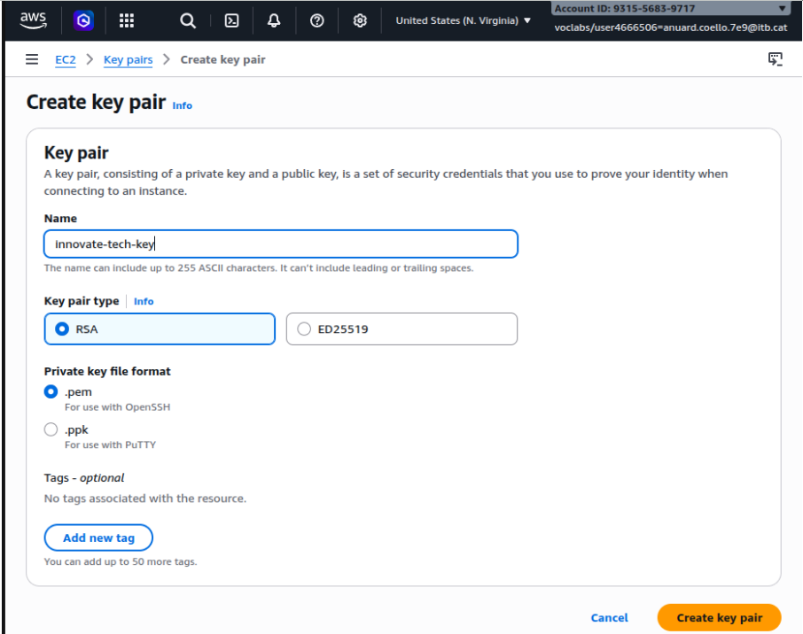

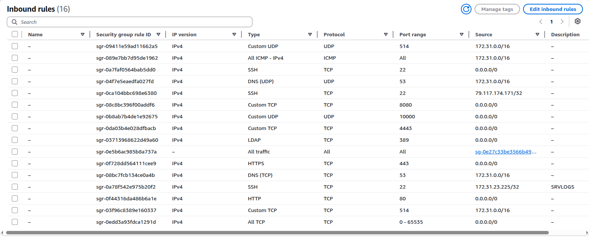

* Vam aixecar **5 servidors clau** (Instàncies EC2) amb Ubuntu, cadascun amb un rol específic:
    * **Màquina 1: Servei Web - Apache / SFTP (Ansible)**
    * **Màquina 2: LDAP** (i servidor de resolució DNS)
    * **Màquina 3: Centralització de logs (Ansible)** (Node de control mestre)
    * **Màquina 4: Servidor de Streaming**
    * **Màquina 5: Base de Dades (Maria DB)**

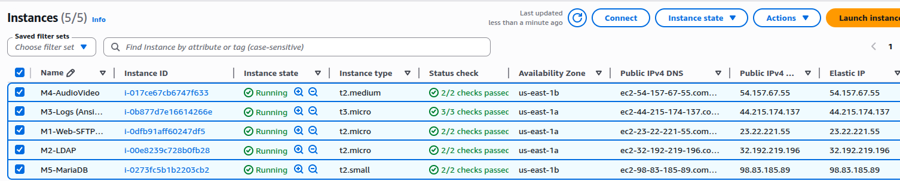

---

## 🤖 3. Automatització de la Infraestructura amb Ansible
En una empresa real, anar màquina per màquina instal·lant serveis a mà és ineficient i molt propens a errors humans. Per això, hem implantat **Ansible** per centralitzar la configuració mitjançant codi (*Infrastructure as Code*).

A la **Màquina 1**, em vaig encarregar de donar d'alta l'usuari `admin-itb` amb permisos d'administrador (sudo) i li vaig configurar les nostres claus SSH. Després, des de la nostra **Màquina 3** (el cervell d'Ansible), vam definir l'inventari de hosts i vam iniciar la màgia. Vaig escriure i llançar el nostre primer Playbook (`mi_config.yml`). Aquest script es va connectar per SSH a la Màquina 1, va actualitzar els paquets del sistema i va instal·lar Apache2 de manera totalment desatesa i automàtica.

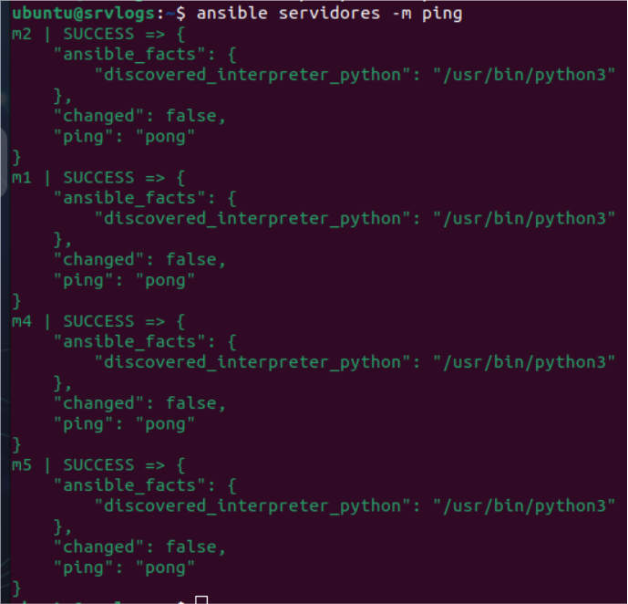

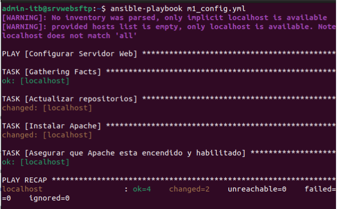

---

## 🔐 4. Servidor Central d'Identitats: LDAP
Per evitar el caos administratiu de tenir comptes d'usuari dispersos i independents a cada servidor, vam implantar un directori actiu utilitzant el protocol LDAP (Lightweight Directory Access Protocol) a la **Màquina 2**. 

Vaig configurar el nostre propi arbre de domini anomenat `innovatetech.itb.cat`. Per poblar aquest directori, vaig injectar al servidor una sèrie de fitxers d'estructura `.ldif` per crear les unitats organitzatives (OUs) de *grups* i *usuaris*. A tall de validació, vam crear el nostre primer usuari corporatiu 100% centralitzat: `sftpuser`, assignant-li un ID de grup, un directori *home* i la seva respectiva contrasenya.

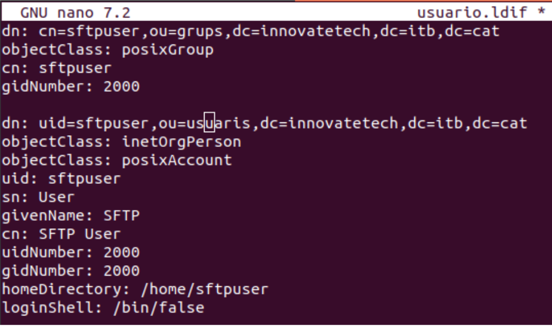

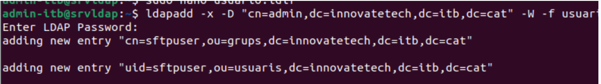

---

## 📁 5. Integració del Client LDAP (SSSD) i SFTP Segur
L'LDAP de la M2 és inútil si la resta de màquines no saben com preguntar-li qui són els usuaris. El següent pas va ser vincular el nostre servidor web amb aquesta base d'identitats.

Vaig instal·lar el dimoni **SSSD** a la **Màquina 1** i el vaig configurar perquè llegís i interpretés els usuaris allotjats a la Màquina 2 de manera transparent.

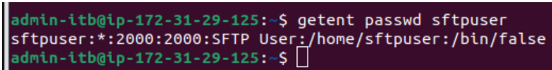

A continuació, vam implementar un servei de transferència de fitxers segur (**SFTP**). Per garantir que un usuari subcontractat o extern no pogués tafanejar els fitxers crítics del sistema operatiu Ubuntu, vaig aplicar una política estricta de seguretat anomenada **Chroot Jail** (`ChrootDirectory` a SSH). Això "engabia" el `sftpuser` quan es connecta, limitant la seva visió exclusivament a la seva carpeta assignada `/home/sftpuser/pujades`. Finalment, vam modificar el *DocumentRoot* d'Apache perquè carregués el contingut d'aquesta mateixa carpeta de cara al públic.

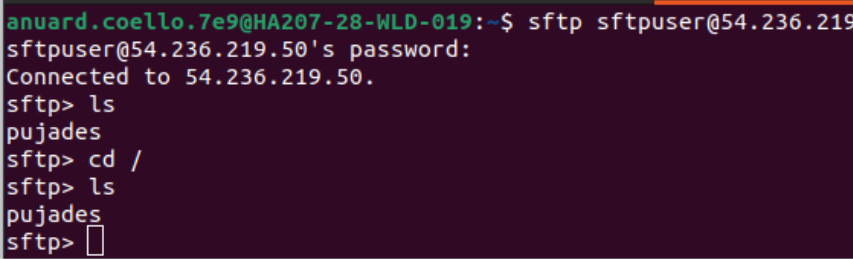

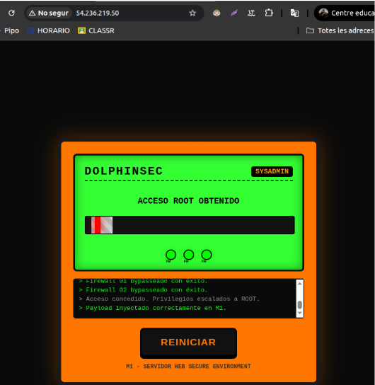

---

## 📡 6. Auditoria i Centralització de Logs
La traçabilitat és clau en la ciberseguretat. Per evitar haver d'accedir a 5 servidors diferents a la recerca de fallades o accessos no autoritzats, vam configurar la **Màquina 3** com el nostre SIEM (Gestor d'esdeveniments i informació) bàsic.

A la Màquina 3, vaig descomentar els mòduls `imudp` i `imtcp` en la configuració de `rsyslog` perquè obrís el port 514 i escoltés el trànsit de xarxa. Posteriorment, amb un nou Playbook d'Ansible (`configurar_logs.yml`), vaig modificar de cop la configuració interna de tots els altres servidors. La regla injectada obligava cada màquina a enviar una còpia en temps real de qualsevol esdeveniment del sistema (errors, reinicis, inicis de sessió) directament a la Màquina 3. Ara disposem d'un punt únic de monitoratge.

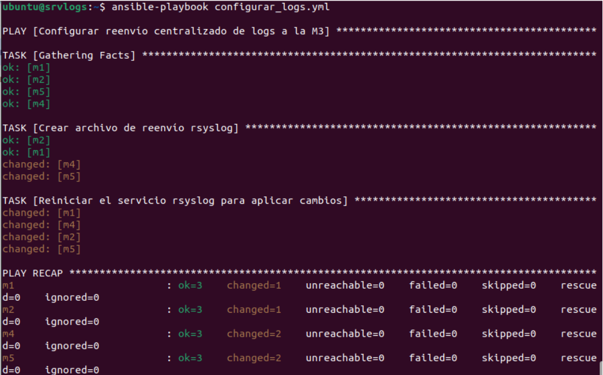

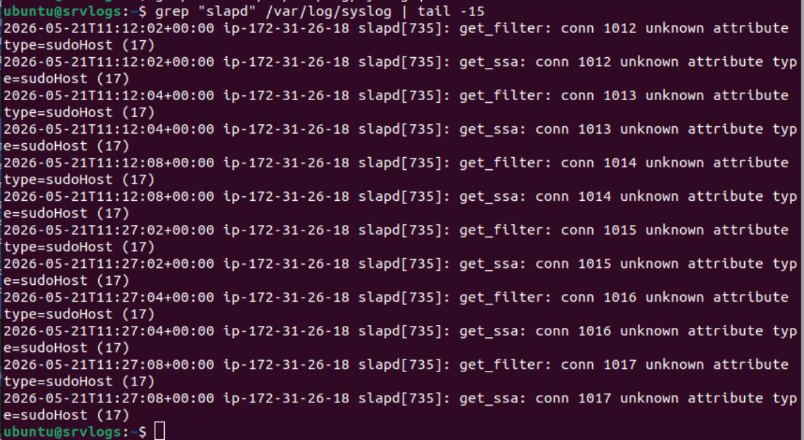

---

## 🐘 7. Integració Dinàmica: Instal·lació de PHP
Per garantir que el nostre portal no fos només un aparador d'HTML estàtic i tingués el potencial d'interactuar amb aplicacions modernes, vaig dotar la infraestructura web de capacitats de processament dinàmic.

Al servidor web (**Màquina 1**), vaig procedir a la instal·lació del motor **PHP** juntament amb el paquet d'enllaç `php-mysql`. Aquesta llibreria és el pont vital que permetrà que qualsevol aplicació web allotjada a la M1 pugui consultar i escriure dades directament a la nostra **Màquina 5: Base de Dades (Maria DB)**. Per verificar que el mòdul s'havia carregat correctament a Apache, vaig generar un fitxer de diagnòstic `info.php` que ens va confirmar que l'entorn de desenvolupament estava llest.

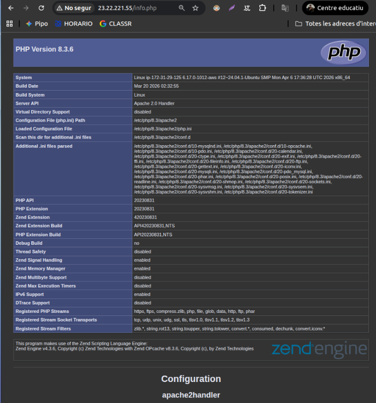

---

## 🌍 8. Resolució de Noms: Servidor DNS Intern
En una xarxa amb múltiples serveis, memoritzar i introduir adreces IP públiques o privades cada vegada que les màquines necessiten parlar entre elles és inviable. Per solucionar aquest problema, vam muntar un servidor **DNS** autoritatiu basat en `bind9` dins de la **Màquina 2**. 

Vaig definir un fitxer de zona directa per al domini privat `itb.local`. En aquest fitxer, vaig vincular noms lògics i descriptius a cada node (`web`, `ldap`, `logs`, `stream`, `bd`) perquè apuntessin a les seves respectives IPs privades. Un cop la guia telefònica va estar llesta, vaig programar un altre Playbook d'Ansible (`configurar_dns.yml`) que va modificar el fitxer `systemd-resolved` de totes les màquines en segons, obligant-les a consultar a la Màquina 2 per a qualsevol traducció de domini.

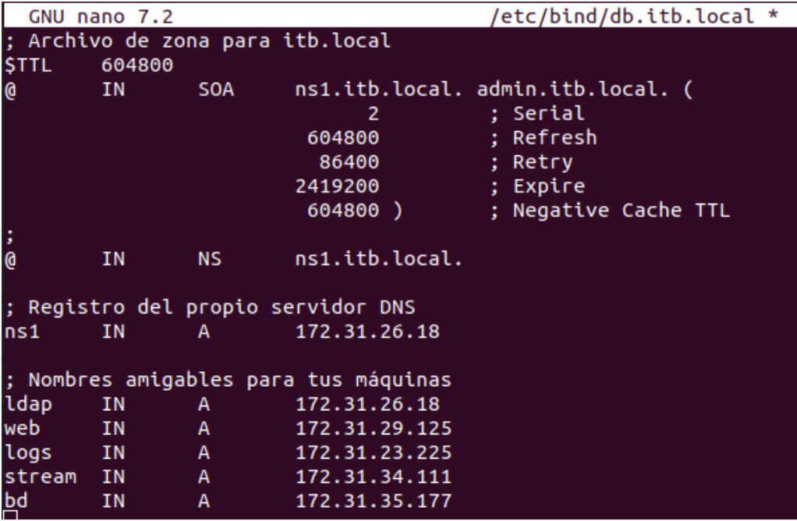

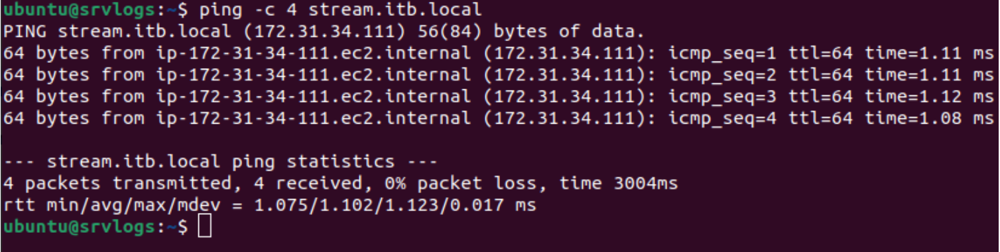

---

## 🔗 9. Integració Global al Domini (El Playbook Mestre)
Per consolidar la infraestructura d'identitat, faltava estendre la configuració de l'SSSD a tots els terminals del projecte. Vaig preparar el Playbook mestre: `unir_dominio.yml`. 

Amb la sola pulsació de l'*Enter*, Ansible va viatjar simultàniament a la **Màquina 1**, **Màquina 4** i **Màquina 5**, va instal·lar els paquets client de LDAP, va injectar la ruta de la M2 com a autoritat d'identificació i, com a detall tècnic vital, va activar el mòdul `mkhomedir` mitjançant PAM. Aquesta funcionalitat assegura que quan qualsevol empleat registrat a LDAP inicia sessió per primera vegada en un servidor, el sistema operatiu li genera a l'instant la seva carpeta de treball personal.

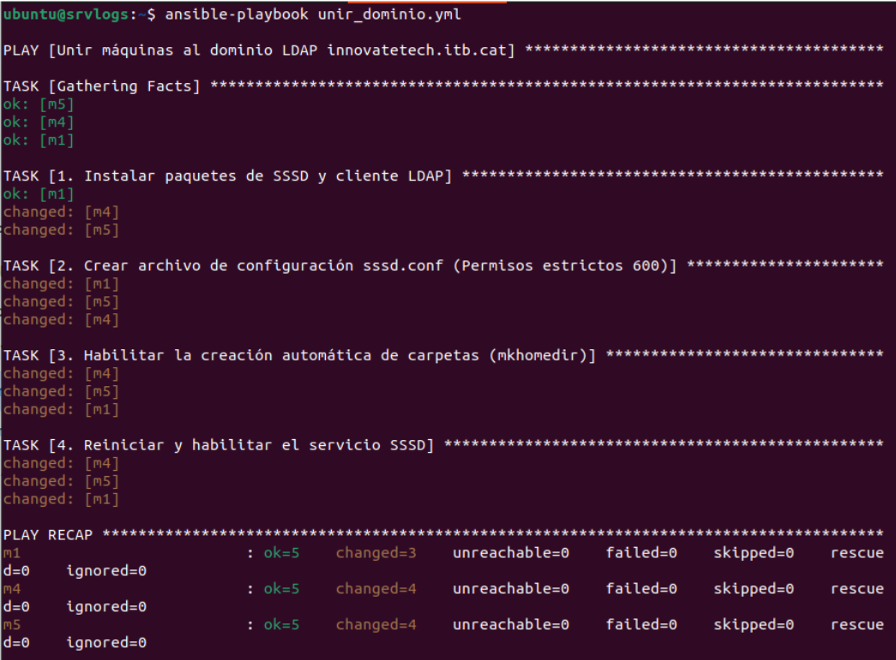

---

## 🛡️ 10. Fortificació Criptogràfica HTTPS (SSL)
El tancament tècnic del nostre desplegament va ser la fortificació de la comunicació web. Desplegar serveis corporatius únicament per HTTP (port 80) deixa el trànsit vulnerable a escoltes o intercepcions, per la qual cosa necessitàvem activar el protocol HTTPS (port 443).

En tractar-se d'un domini privat (`web.itb.local`) inaccessible des de l'internet global, les autoritats certificadores comercials no ens podien validar. Com a administrador de sistemes, vaig generar el meu propi **certificat criptogràfic autosignat** (`web-itb.crt` i `.key`) fent ús del paquet criptogràfic OpenSSL, emprant el robust algorisme RSA de 2048 bits. Finalment, vaig dissenyar i habilitar un nou fitxer de bloc *VirtualHost* a Apache (`web-ssl.conf`) indicant-li les rutes de les claus, aconseguint així que totes les comunicacions del nostre portal web estiguin xifrades d'extrem a extrem.

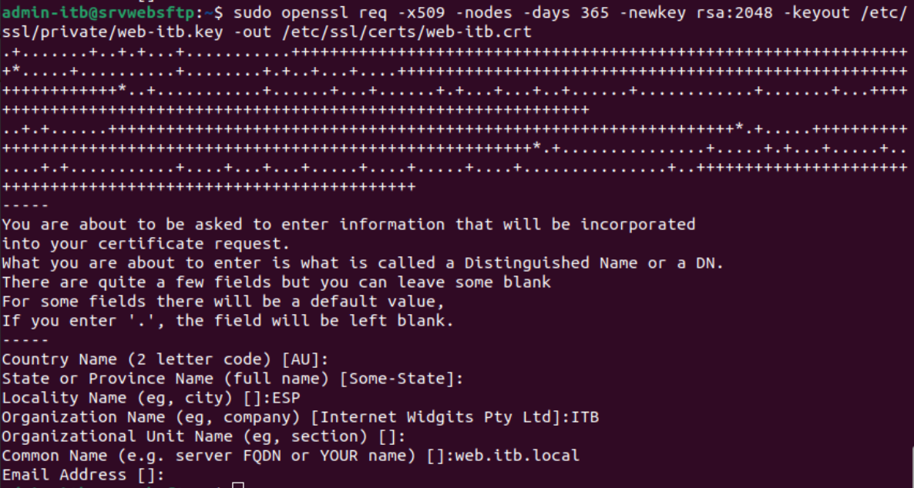

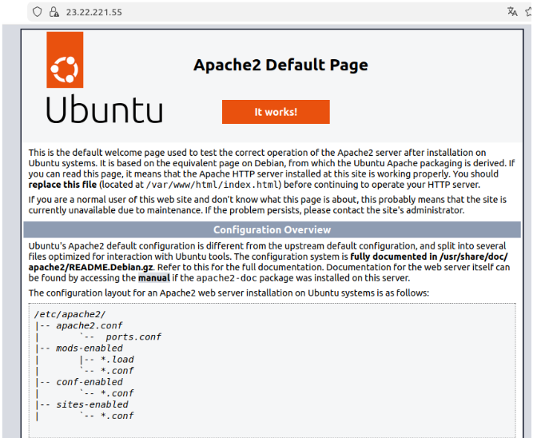

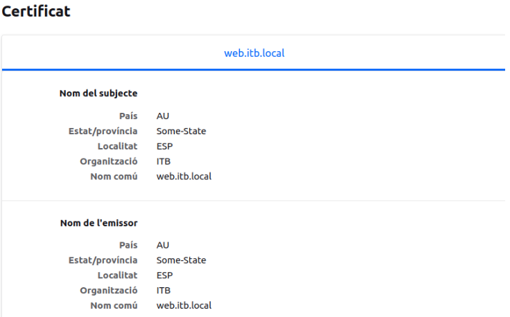

---

**Conclusió**
El desenvolupament exhaustiu d'aquest Projecte Transversal ens ha servit per simular les problemàtiques i arquitectures reals dels entorns *Cloud* empresarials. L'adopció d'AWS ens va proporcionar l'escalat, Ansible va reduir les hores de configuració manual a uns pocs segons d'execució, LDAP ens va brindar el control absolut sobre els accessos i la centralización del DNS i els logs va simplificar enormement el manteniment. Amb l'encriptació i els engabiats SFTP afegits, entreguem una arquitectura funcional, redundant i altament fortificada.
