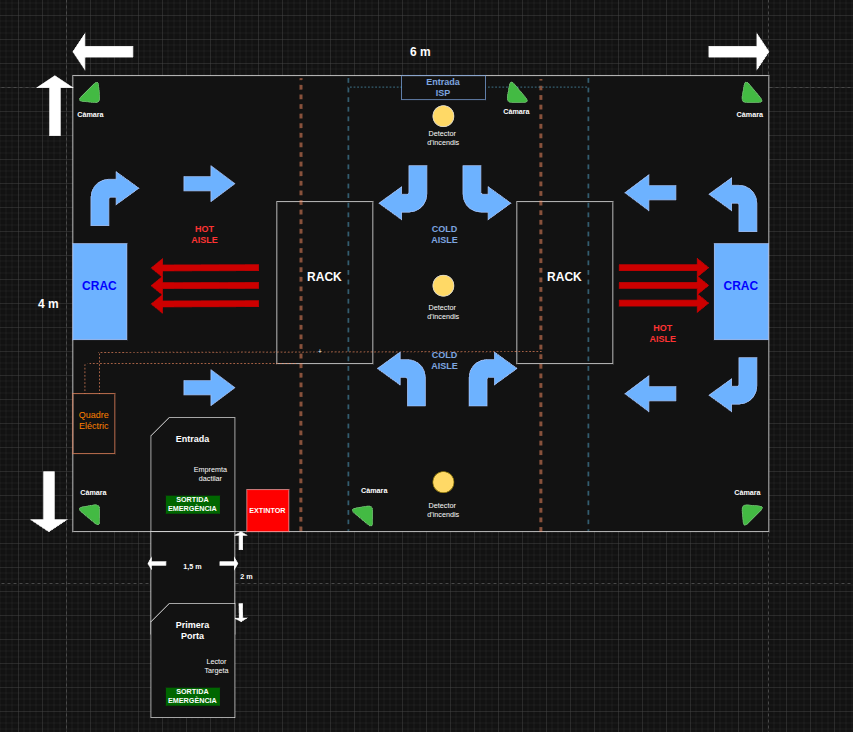
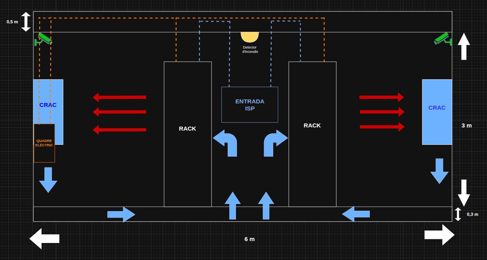
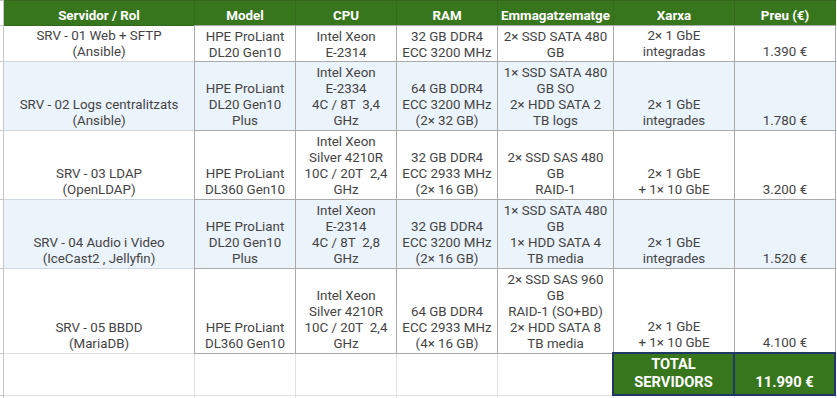
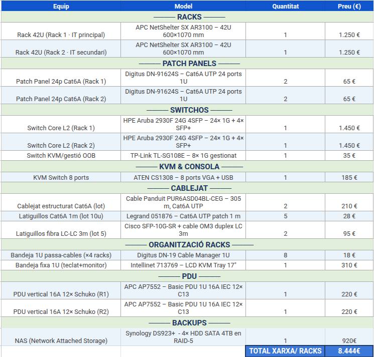
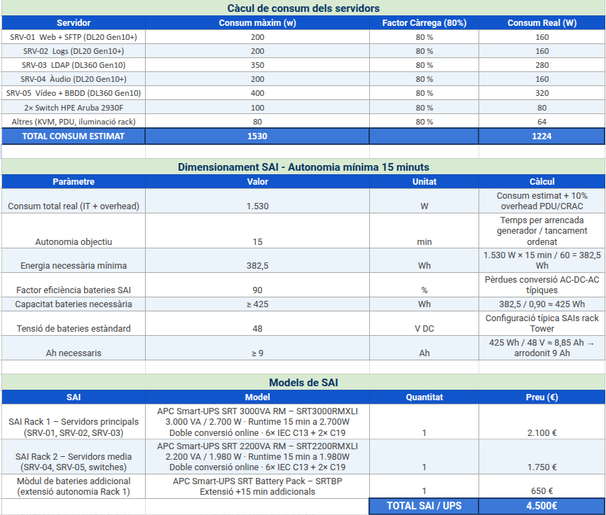
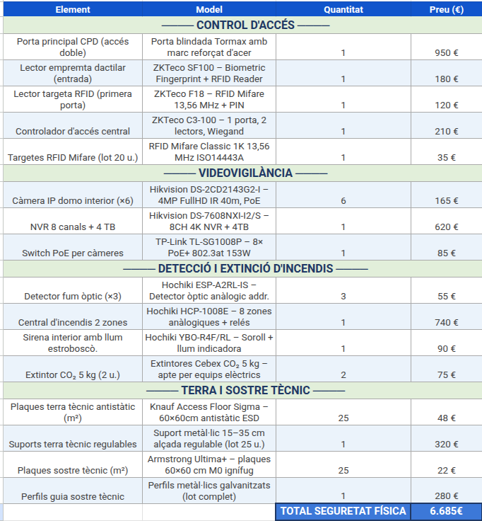
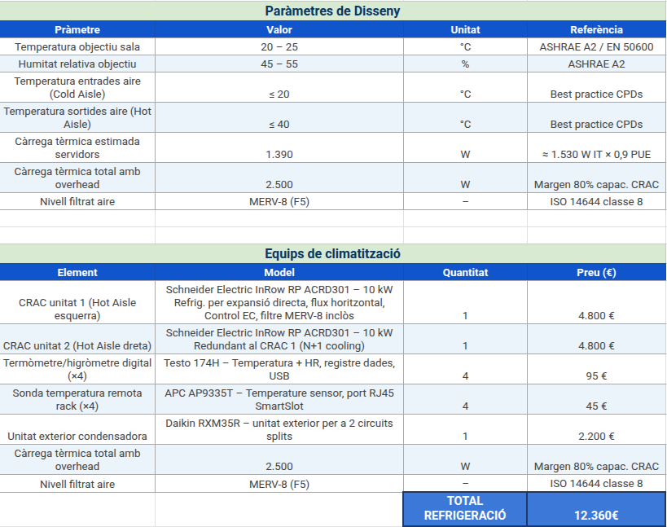
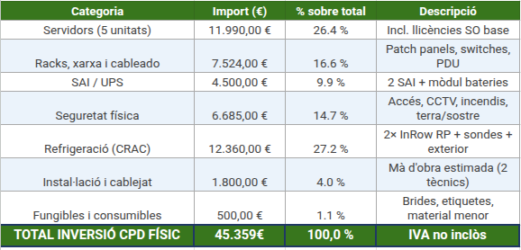
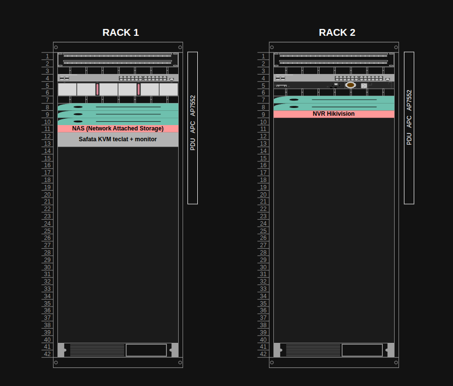
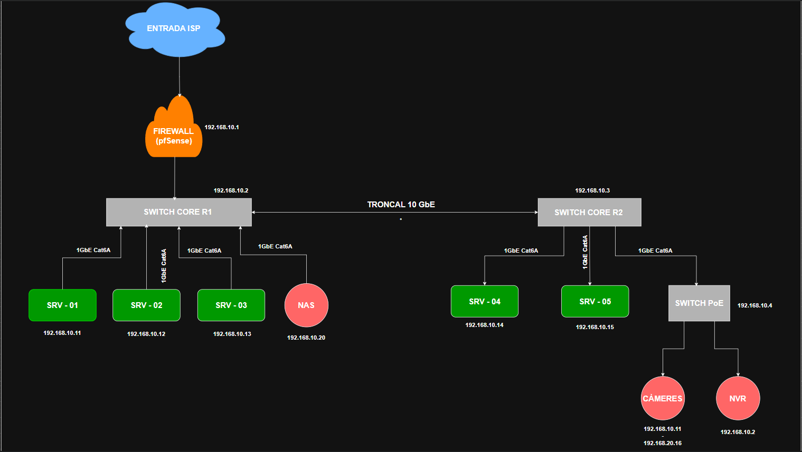

# BLOC 1: PROPOSTA CPD — InnovateTech

---

## Índex

- [1.1. Introducció](#11-introducció)
- [1.2. Ubicació i disseny de la sala de CPD](#12-ubicació-i-disseny-de-la-sala-de-cpd)
  - [1.2.1. Ubicació](#121-ubicació)
  - [1.2.2. Plànols de la sala](#122-plànols-de-la-sala)
- [1.3. Distribució de la sala](#13-distribució-de-la-sala)
  - [1.3.1. Característiques de la sala](#131-característiques-de-la-sala)
  - [1.3.2. Seguretat física](#132-seguretat-física)
  - [1.3.3. Climatització](#133-climatització)
  - [1.3.4. Cablejat](#134-cablejat)
- [1.4. Inventari](#14-inventari)
  - [1.4.1. Servidors](#141-servidors)
  - [1.4.2. Racks, Xarxa i Cablejat](#142-racks-xarxa-i-cablejat)
  - [1.4.3. SAI - UPS](#143-sai---ups)
  - [1.4.4. Seguretat Física](#144-seguretat-física)
  - [1.4.5. Refrigeració](#145-refrigeració)
  - [1.4.6. Resum Econòmic](#146-resum-econòmic)
- [1.5. Distribució dels racks](#15-distribució-dels-racks)
  - [1.5.1. Esquema visual](#151-esquema-visual)
  - [1.5.2. Llegenda de l'esquema](#152-llegenda-de-lesquema)
- [1.6. Instal·lació de la Xarxa](#16-installació-de-la-xarxa)
  - [1.6.1. Descripció general](#161-descripció-general)
  - [1.6.2. Esquema Visual](#162-esquema-visual)
  - [1.6.3. Elements de la xarxa](#163-elements-de-la-xarxa)
  - [1.6.4. Adreçament IP](#164-adreçament-ip)
  - [1.6.5. VLANs](#165-vlans)
- [1.7. Seguretat lògica](#17-seguretat-lògica)
  - [1.7.1. Firewall](#171-firewall)
  - [1.7.2. Control d'accés lògic](#172-control-daccés-lògic)
  - [1.7.3. Monitoratge](#173-monitoratge)
  - [1.7.4. RAIDs](#174-raids)
  - [1.7.5. Còpies de Seguretat (Backups)](#175-còpies-de-seguretat-backups)
  - [1.7.6. Prevenció de riscos laborals (PRL)](#176-prevenció-de-riscos-laborals-prl)

---

## 1.1. Introducció

En aquest bloc del projecte, presentarem una proposta d'una sala CPD física per a
l'empresa InovateTech.

En tot el projecte, els serveis que crearem i configurarem per al CPD els farem en
cloud, específicament en AWS, però en aquest apartat parlarem de com crearíem un
CPD real, tenint en compte la ubicació dins de l'edifici, la distribució dels elements
dins la sala, la seguretat tant física com lògica, la climatització i el cablejat.

Tot això ho farem mitjançant plànols, dissenys i esquemes, tant de la sala com del
hardware dels racks fins a un esquema de com funcionaria la xarxa. Després, durem
a terme un inventari de tot el que necessitarem en un full de càlcul, per treure el
pressupost total del muntatge.

Finalment, ja ens ficarem en la part del AWS, parlant de com distribuirem els serveis
a utilitzar i quins tipus de màquines desplegarem per començar amb la resta del
projecte.

[↑ Tornar a l'índex](#Índex)
---

## 1.2. Ubicació i disseny de la sala de CPD

### 1.2.1. Ubicació

Sempre al pensar en la ubicació d'un CPD, s'han de tenir diverses coses en compte:
l'accés, la seguretat i la climatització.

En aquest cas per complir amb aquests 3 paràmetres, pensem que el millor lloc es
trobaria en un soterrani, una planta que estigui sota terra per evitar qualsevol accés
o penetració des de la superfície. Amb aquesta ubicació augmentem la seguretat
d'accés i l'aïllament climàtic, ja que necessitem que la sala tingui la seva pròpia
climatització per a l'escalfament dels racks.

L'entrada a la sala es trobarà en un passadís o en la part menys concorreguda de la
planta. La porta hauria de ser del mateix color que la paret per disminuir la seva
visualització des de lluny, i òbviament, no hi ha d'haver cap senyalització que indiqui
el lloc de la sala. Els empleats autoritzats ja haurien de saber on es troba el CPD.
D'aquesta forma, ja augmentem la seguretat quant a la ubicació de la sala, per
evitar que qualsevol persona pugui trobar o saber on es troba.

---

### 1.2.2. Plànols de la sala

**Vista de planta**

**Vista de perfil**

---

## 1.3. Distribució de la sala

### 1.3.1. Característiques de la sala

La sala té unes mesures de 6 metres de llarg, 4 d'amplada i 3 metres d'altura normal.

Les parets estan construïdes amb materials ignífugs i amb aïllament tèrmic i acústic.
Estan pintades amb pintura antiestàtica per evitar l'acumulació de pols i partícules,
sense finestres.

El sostre és tècnic i desmuntable, té una mesura de 0,5 m per sobre dels 3 metres
reals de la sala, cosa que permet el pas del cablejat i dels sensors per la part superior.

El terra és tècnic i elevat uns 30 cm sobre el terra real, format per rajoles
antiestàtiques. Aquest espai permet distribuir l'aire fred dels equips de climatització,
fins a arribar a unes rajoles amb forats que dona accés directe al passadís que hi ha
entre els racks, per on pujarà l'aire refrigerant la maquinària.

Finalment, la porta que connecta directament amb la sala està blindada d'acer amb
tancament automàtic i obertura cap a l'exterior.

[↑ Tornar a l'índex](#Índex)
---

### 1.3.2. Seguretat física

A l'hora de dissenyar el plànol, hem hagut de tenir en compte certs factors per a la
seguretat física del CPD.

**Control d'accés**
Hem utilitzat doble factor d'autenticació mitjançant dues portes. La primera porta
demana un lector de targeta, que una vegada validat, et portarà a una petita sala de
2×1,5 m per al segon mètode d'autenticació. Allà hi ha una porta blindada que
demanarà una empremta dactilar per finalment accedir a la sala.

**Videovigilància**
La sala tindrà 6 càmeres en total: una en cada racó per tenir una visualització de
tots els passadissos al voltant dels racks, i dues càmeres més a cada costat del
passadís fred per vigilar l'accés directe als racks.

**Protecció contra incendis i sortides d'emergència**
Hi ha 3 detectors d'incendis al llarg del passadís fred. També hi ha un extintor de
CO₂ al costat de l'entrada. A les portes hi ha senyalitzacions de sortida d'emergència,
ja que és l'única entrada i sortida de la sala.

---

### 1.3.3. Climatització

La sala del CPD utilitza dos equips CRAC (Computer Room Air Conditioning) situats
a banda i banda de la sala, un a l'esquerra i un a la dreta, tal com es pot veure al
plànol.

El sistema segueix una distribució de passadissos freds i calents (Cold Aisle / Hot Aisle):

- Els racks estan orientats de manera que les parts frontals (on s'aspira l'aire fred)
  donen als passadissos freds.
- Les parts posteriors (on s'expulsa l'aire calent) donen als passadissos calents,
  on els CRACs recullen l'aire i el refrigeren de nou.

Els CRACs impulsen l'aire fred pel terra tècnic cap als passadissos freds, i recullen
l'aire calent dels passadissos calents per refrigerar-lo i tornar-lo a impulsar. Aquest
cicle es repeteix constantment per mantenir la temperatura de la sala entre **20°C i
25°C** i la humitat relativa entre el **45% i el 55%**.

Els dos equips treballen en configuració **N+1**, és a dir, un d'ells pot assumir tota
la càrrega en cas que l'altre falli, garantint la continuïtat del servei en tot moment.

---

### 1.3.4. Cablejat

El cablejat de la sala segueix un recorregut ordenat i estructurat per garantir la
neteja visual, la seguretat i el fàcil manteniment.

Des de l'entrada ISP i des del quadre elèctric, situats a la paret esquerra de la sala
i a la paret nord, surten dos circuits independents, un per a cada rack. Aquesta
separació garanteix que cada rack disposa de la seva pròpia línia de dades i
d'alimentació elèctrica.

Els cables pugen fins al sostre tècnic, on es distribueixen horitzontalment per tota
la sala mitjançant safates de cablejat (cable trays). Aquest recorregut aeri permet
mantenir el terra lliure d'obstacles i facilita el manteniment i la identificació dels
cables en tot moment. Un cop els cables arriben a la vertical de cada rack, baixen
ordenadament fins als patch panels situats a la part superior de cada rack, on es
connecten de forma etiquetada i estructurada.

El cablejat de dades i el cablejat elèctric discorren per safates separades al sostre
tècnic per evitar interferències electromagnètiques.

Dins de cada rack, el cablejat s'organitza mitjançant passacables de 1U situats entre
els diferents equips, mantenint els latiguillos recollits i identificats amb etiquetes en
ambdós extrems.

---

## 1.4. Inventari

### 1.4.1. Servidors

S'han escollit servidors HPE (Hewlett Packard Enterprise) per la seva fiabilitat
contrastada en entorns empresarials i el seu bon suport tècnic. Els serveis menys
exigents (Web+SFTP, Logs i Àudio) utilitzen el model DL20 Gen10 Plus, un servidor
1U de gamma mitjana amb una bona relació qualitat-preu. Els serveis més exigents
(LDAP, Vídeo i Base de Dades) utilitzen el model DL360 Gen10, més potent i amb
suport de redundància en alimentació. Tots els servidors inclouen discos SSD per al
sistema operatiu i discos HDD per a les dades, optimitzant el cost sense sacrificar
rendiment.

[↑ Tornar a l'índex](#Índex)
---

### 1.4.2. Racks, Xarxa i Cablejat

S'han escollit dos racks APC NetShelter SX de 42U, un estàndard del sector que
ofereix bona ventilació, accessibilitat i compatibilitat amb tots els equips. Els
switches HPE Aruba 2930F proporcionen connectivitat de fins a 10 GbE entre racks
i 1 GbE cap als servidors, suficient per als serveis desplegats. El cablejat estructurat
Cat6A garanteix transmissions de fins a 10 GbE i és la categoria recomanada per a
nous desplegaments de CPD.

---

### 1.4.3. SAI - UPS

S'han escollit dos SAIs APC Smart-UPS SRT de doble conversió online, que aïllen
completament els servidors de la xarxa elèctrica i proporcionen una autonomia
mínima de 15 minuts. Aquest temps és suficient per realitzar un tancament ordenat
de tots els serveis o per engegar un generador extern en cas de tall elèctric
prolongat. S'ha escollit APC per ser un dels fabricants més fiables del mercat en
sistemes d'alimentació ininterrompuda.

---

### 1.4.4. Seguretat Física

Per al control d'accés s'ha escollit ZKTeco, fabricant especialitzat en sistemes
biomètrics amb una àmplia implantació en entorns empresarials. Les càmeres i el
NVR són de Hikvision, una de les marques líders en videovigilància IP, amb
resolució de 4MP i visió nocturna. Per a la detecció d'incendis s'ha optat per
Hochiki, fabricant reconegut en sistemes de detecció analògica. Els extintors són de
CO₂, adequats per a sales amb equipament electrònic ja que no deixen residus.

[↑ Tornar a l'índex](#Índex)

---

### 1.4.5. Refrigeració

S'han escollit dos equips CRAC Schneider Electric InRow RP de 10 kW cadascun,
en configuració N+1, és a dir, un equip pot assumir tota la càrrega si l'altre falla.
Schneider Electric és un dels fabricants de referència en refrigeració per a CPDs.
La capacitat total de 20 kW és més que suficient per a la càrrega tèrmica estimada
de 2,5 kW, deixant un marge ampli per a futures ampliacions.

---

### 1.4.6. Resum Econòmic

La inversió total en infraestructura física del CPD és d'aproximadament 46.189€
(IVA no inclòs), distribuïda principalment entre servidors, refrigeració i seguretat
física. Aquest pressupost és coherent amb una empresa de gamma mitjana com
InnovateTech.

---

## 1.5. Distribució dels racks

La sala disposa de dos racks APC NetShelter SX de 42U cadascun. Els equips
estan distribuïts seguint criteris de pes, accessibilitat i gestió tèrmica: la xarxa i els
servidors a la part superior i mitjana, i els SAIs a la part inferior per estabilitat. Els
espais buits estan reservats per a futures ampliacions.

### 1.5.1. Esquema visual

[↑ Tornar a l'índex](#Índex)

---

### 1.5.2. Llegenda de l'esquema

| Unitat Rack | Rack 1 | Rack 2 |
|:-----------:|--------|--------|
| 1 | Patch Panel Cat6A | Patch Panel Cat6A |
| 2 | Patch Panel Cat6A | Patch Panel Cat6A |
| 3 | Organitzador de cable | Organitzador de cable |
| 4 | Switch HPE Aruba 2930F | Switch HPE Aruba 2930F |
| 5 | Switch KVM/Gestió OOB | Switch PoE TP-Link TL-SG108P |
| 6 | Organitzador de cable | Organitzador de cable |
| 7 | SRV-01 Web + SFTP | SRV-04 Vídeo + Àudio (Jellyfin + Icecast2) |
| 8 | SRV-02 Logs (Graylog) | SRV-05 BD (MariaDB) |
| 9 | SRV-03 LDAP (OpenLDAP) | NVR Hikvision DS-7608 |
| 10 | Organitzador de cable | Organitzador de cable |
| 11 | NAS Synology DS923+ | — (buit) |
| 12 | Safata KVM teclat + monitor | — (buit) |
| 13 - 40 | Espai reservat per a futures ampliacions | Espai reservat per a futures ampliacions |
| 41 - 42 | SAI APC Smart-UPS SRT 3000VA | SAI APC Smart-UPS SRT 3000VA |

---

## 1.6. Instal·lació de la Xarxa

### 1.6.1. Descripció general

La xarxa del CPD està estructurada de forma jeràrquica, amb un firewall com a punt
d'entrada, dos switches core interconnectats i els servidors distribuïts entre els dos
racks. La xarxa està dividida en dues VLANs per separar el tràfic de servidors del
tràfic de videovigilància.

### 1.6.2. Esquema Visual

[↑ Tornar a l'índex](#Índex)

---

### 1.6.3. Elements de la xarxa

**Firewall (pfSense)**
És el punt d'entrada de la xarxa. Gestiona el tràfic entre l'exterior (ISP) i la xarxa
interna del CPD, aplicant regles de seguretat i controlant els accessos.

**Switch Core R1 i R2**
Dos switches HPE Aruba 2930F, un per rack, interconnectats mitjançant un enllaç
troncal de 10 GbE. El Switch Core R1 és el principal, connectat directament al
firewall. El R2 és el secundari, connectat al R1 i als servidors del Rack 2.

**Switch PoE**
Switch dedicat exclusivament a la xarxa de videovigilància. Alimenta les càmeres IP
mitjançant PoE i connecta el NVR Hikvision. Està connectat al Switch Core R2.

**Servidors**
Els cinc servidors estan connectats als switches core mitjançant enllaços de 1 GbE
Cat6A, cadascun amb una IP fixa assignada.

**NAS Synology**
Connectat al Switch Core R1 mitjançant 1 GbE Cat6A. Emmagatzema els backups
de tots els servidors i és accessible de forma remota des de qualsevol punt de la
xarxa.

[↑ Tornar a l'índex](#Índex)

---

### 1.6.4. Adreçament IP

| Element | IP |
|---------|-----|
| Firewall pfSense (LAN) | 192.168.10.1 |
| Switch Core R1 | 192.168.10.2 |
| Switch Core R2 | 192.168.10.3 |
| Switch PoE | 192.168.10.4 |
| SRV-01 Web + SFTP | 192.168.10.11 |
| SRV-02 Logs (Graylog) | 192.168.10.12 |
| SRV-03 LDAP | 192.168.10.13 |
| SRV-04 Àudio | 192.168.10.14 |
| SRV-05 Vídeo + BD | 192.168.10.15 |
| NAS Synology | 192.168.10.20 |
| Càmeres | 192.168.20.11 - 192.168.20.16 |
| NVR Hikvision | 192.168.20.2 |

---

### 1.6.5. VLANs

La xarxa està dividida en dues VLANs per motius de seguretat i rendiment:

**VLAN 10 – Servidors i gestió (192.168.10.0/24)**
Inclou tots els servidors, els switches core, el firewall i el NAS. És la xarxa
principal del CPD.

**VLAN 20 – Videovigilància (192.168.20.0/24)**
Xarxa aïllada exclusivament per a les càmeres IP i el NVR. Aquesta separació
impedeix que el tràfic de vídeo de vigilància interfereixi amb el tràfic dels
servidors, i limita l'accés a les càmeres des de la xarxa principal.

---

## 1.7. Seguretat lògica

### 1.7.1. Firewall

El CPD disposa d'un firewall pfSense situat entre l'entrada ISP i la xarxa interna.
pfSense és una solució open source àmpliament utilitzada en entorns empresarials
que permet definir regles de tràfic, bloquejar accessos no autoritzats i monitorar les
connexions en temps real.

Les regles principals aplicades són:

- Només es permeten els ports estrictament necessaris per a cada servei
  (HTTP/HTTPS, SFTP, LDAP, streaming...).
- Tot el tràfic entrant no autoritzat és bloquejat per defecte.
- El tràfic entre la VLAN 10 i la VLAN 20 està restringit, impedint l'accés a les
  càmeres des de la xarxa de servidors.

[↑ Tornar a l'índex](#Índex)

---

### 1.7.2. Control d'accés lògic

L'accés als servidors es realitza exclusivament mitjançant clau pública/privada SSH,
sense possibilitat d'accés per contrasenya. Cada servidor disposa d'un usuari
d'administració específic, diferent de l'usuari per defecte del sistema.

La gestió centralitzada d'usuaris es realitza mitjançant el servidor LDAP (SRV-03),
que actua com a directori actiu per a tots els serveis del CPD. D'aquesta manera,
els permisos i accessos es gestionen des d'un únic punt.

---

### 1.7.3. Monitoratge

El servidor SRV-02 s'encarrega de la centralització de logs mitjançant Graylog.
Tots els servidors envien els seus logs a aquest servidor, cosa que permet detectar
anomalies, errors i intents d'accés no autoritzat de forma centralitzada.

Els SAIs estan connectats a la xarxa i poden ser monitorats remotament, enviant
alertes en cas de tall elèctric o baixada de bateria.

---

### 1.7.4. RAIDs

Tots els servidors utilitzen configuració RAID per protegir les dades en cas de
fallada d'un disc:

- **SRV-01, SRV-02 i SRV-04** → RAID-1 (mirall entre dos discos). Si un disc
  falla, l'altre continua funcionant sense pèrdua de dades.
- **SRV-03 i SRV-05** → RAID-1 per als discos del sistema operatiu i la base
  de dades.
- **NAS Synology** → RAID-5 amb 4 discos de 4TB, proporcionant 12TB
  d'espai útil i tolerància a la fallada d'un disc.

[↑ Tornar a l'índex](#Índex)

---

### 1.7.5. Còpies de Seguretat (Backups)

Les còpies de seguretat es realitzen de forma automatitzada mitjançant scripts
programats i es guarden al NAS Synology, accessible des de qualsevol punt de la
xarxa interna.

**Tipus de còpies:**

- **Còpia completa (Full Backup):** es realitza cada diumenge a les 02:00h.
  Fa una còpia de totes les dades de tots els servidors. És la còpia més lenta
  però la més completa, i serveix com a punt de restauració base per a la
  resta de còpies de la setmana.
- **Còpia incremental:** es realitza de dilluns a dissabte a les 02:00h. Només
  copia les dades que han canviat des de l'última còpia realitzada. És molt
  més ràpida i ocupa menys espai que una còpia completa.
- **Còpia diferencial:** es realitza cada dimecres a les 02:00h addicionalment.
  Copia tots els canvis des de l'última còpia completa de diumenge. Permet
  una restauració més ràpida que la incremental, ja que només cal la còpia
  completa i la diferencial.
- **Còpia física:** es fa una imatge completa del disc de cada servidor
  (snapshot), cosa que permet restaurar tot el sistema operatiu i la
  configuració en cas de fallada total del servidor.
- **Còpia lògica:** es fa un dump de les bases de dades (MariaDB) per poder
  restaurar únicament les dades sense necessitat de restaurar tot el servidor.

**Estratègia 3-2-1:**

- **3** còpies de les dades.
- **2** suports d'emmagatzematge diferents (NAS local + núvol AWS S3).
- **1** còpia offsite (AWS S3), protegint les dades en cas d'incendi o desastre
  físic a la sala CPD.

**Retenció de còpies:**

- Les còpies completes es conserven durant **1 mes**.
- Les còpies incrementals i diferencials es conserven durant **2 setmanes**.
- Les còpies a AWS S3 es conserven durant **3 mesos**.

[↑ Tornar a l'índex](#Índex)

---

### 1.7.6. Prevenció de riscos laborals (PRL)

El CPD compleix amb les mesures bàsiques de prevenció de riscos laborals
aplicables a una sala de servidors:

- **Senyalització:** la sala disposa de senyals de sortida d'emergència i
  d'extinció d'incendis visibles en tot moment.
- **Il·luminació d'emergència:** llums autònomes que s'activen automàticament
  en cas de tall elèctric.
- **Vies d'evacuació:** la porta principal obre cap a l'exterior i disposa de
  barra antipànic per facilitar l'evacuació ràpida.
- **Extintors:** un extintor de CO₂ situat a prop de la porta d'entrada, adequat
  per a focs elèctrics sense deixar residus als equips.

  [↑ Tornar a l'índex](#Índex)

- **Terra antilliscant:** el terra tècnic té acabat antilliscant per evitar caigudes
  durant les tasques de manteniment.
- **Gestió del cablejat:** tot el cablejat està ordenat i recollit per evitar
  ensopegades durant els treballs a l'interior de la sala.
