# Projecte-Transversal
# Bloc 0377 — Administració de Bases de Dades
## InnovateTech · Documentació Tècnica de la Base de Dades

> **Projecte Transversal ASIXc1 · Curs 2025/2026**  
> Mòdul 0377 — Administració de Bases de Dades  
> Institut Tecnològic de Barcelona

---

## Índex

1. [Diagrama E/R i Model Relacional](#1-diagrama-er-i-model-relacional)
2. [Instal·lació i Configuració de MariaDB](#2-installació-i-configuració-de-mariadb)
3. [Creació de la Base de Dades i Taules](#3-creació-de-la-base-de-dades-i-taules)
4. [Dades de Prova](#4-dades-de-prova)
5. [Creació de Rols i Permisos](#5-creació-de-rols-i-permisos)
6. [Script de Creació Automatitzada d'Usuaris](#6-script-de-creació-automatitzada-dusuaris)
7. [Triggers de Control i Auditoria](#7-triggers-de-control-i-auditoria)
8. [Event Periòdic de Backup](#8-event-periòdic-de-backup)
9. [Conclusions](#9-conclusions)

---

## 1. Diagrama E/R i Model Relacional

### 1.1 Diagrama Entitat-Relació

El diagrama E/R representa totes les entitats, atributs i relacions de la base de dades d'InnovateTech. Les entitats s'han organitzat en 5 blocs funcionals: **Personal i Organització**, **Comunicació Interna**, **Contingut i Nòmines**, **Vendes i Clients** i **Auditoria i Sistema**.

> 📸 **CAPTURA**: Diagrama E/R complet
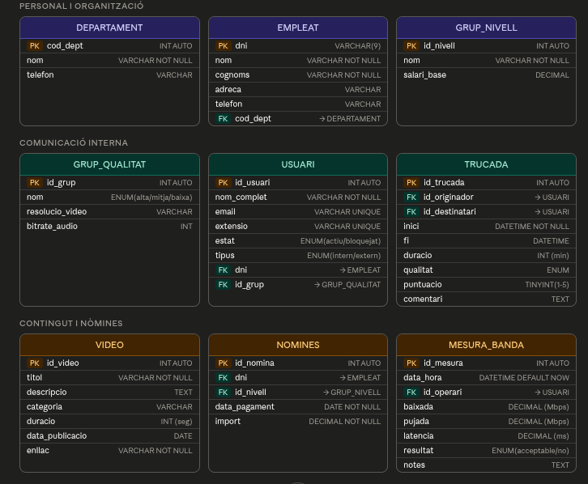
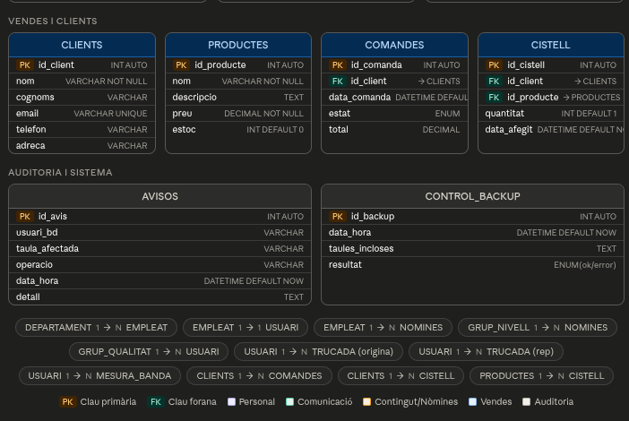

---

### 1.2 Model Relacional

A partir del diagrama E/R s'ha obtingut l'esquema relacional complet. Per a cada taula s'indica el nom, els atributs, la clau primària (PK) i les claus foranes (FK).

#### Personal i Organització

```
DEPARTAMENT (cod_dept PK, nom, telefon)

EMPLEAT (dni PK, nom, cognoms, adreca, telefon, cod_dept FK→DEPARTAMENT)

GRUP_NIVELL (id_nivell PK, nom, salari_base)

NOMINES (id_nomina PK, dni FK→EMPLEAT, id_nivell FK→GRUP_NIVELL, data_pagament, import)
```

#### Comunicació Interna

```
GRUP_QUALITAT (id_grup PK, nom, resolucio_video, bitrate_audio)

USUARI (id_usuari PK, nom_complet, email, extensio, estat, tipus, 
        dni FK→EMPLEAT, id_grup FK→GRUP_QUALITAT)

TRUCADA (id_trucada PK, id_originador FK→USUARI, id_destinatari FK→USUARI, 
         inici, fi, duracio, qualitat, puntuacio, comentari)
```

#### Contingut i Xarxa

```
VIDEO (id_video PK, titol, descripcio, categoria, duracio, data_publicacio, enllac)

MESURA_BANDA (id_mesura PK, data_hora, id_operari FK→USUARI, 
              baixada, pujada, latencia, resultat, notes)
```

#### Vendes i Clients

```
CLIENTS (id_client PK, nom, cognoms, email, telefon, adreca)

PRODUCTES (id_producte PK, nom, descripcio, preu, estoc)

COMANDES (id_comanda PK, id_client FK→CLIENTS, data_comanda, estat, total)

CISTELL (id_cistell PK, id_client FK→CLIENTS, id_producte FK→PRODUCTES, 
         quantitat, data_afegit)
```

#### Auditoria i Sistema

```
AVISOS (id_avis PK, usuari_bd, taula_afectada, operacio, data_hora, detall)

CONTROL_BACKUP (id_backup PK, data_hora, taules_incloses, resultat)
```
---

## 2. Instal·lació i Configuració de MariaDB

### 2.1 Justificació del SGBD

S'ha escollit **MariaDB** com a sistema gestor de bases de dades (SGBD) per les següents raons:

- És una solució open source sense cost de llicència
- Compatible amb MySQL, àmpliament utilitzat en entorns empresarials
- Desplegable en una instància EC2 evitant el cost elevat de RDS
- Rendiment òptim per a bases de dades de gestió empresarial

### 2.2 Instal·lació

```bash
sudo apt update
sudo apt install mariadb-server -y
sudo systemctl start mariadb
sudo systemctl enable mariadb
```


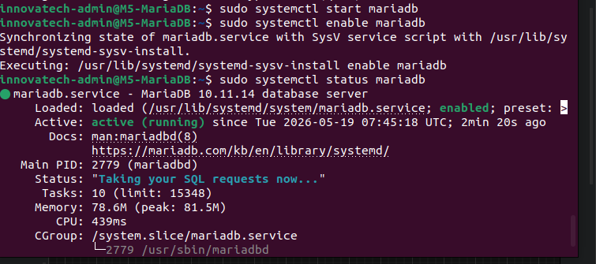

### 2.3 Configuració de seguretat

```bash
sudo mysql_secure_installation
```


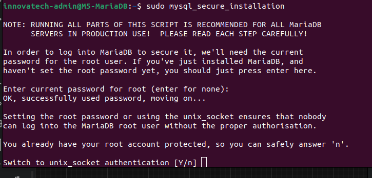

### 2.4 Accés a MariaDB

```bash
sudo mysql -u root -p
```

> 📸 **CAPTURA**: Posar aquí la captura de l'accés a MariaDB
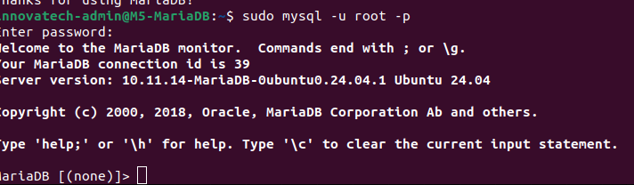

---

## 3. Creació de la Base de Dades i Taules

### 3.1 Creació de la base de dades

S'ha creat la base de dades `innovatetech` amb codificació UTF-8 per suportar caràcters especials del català i castellà:

```sql
CREATE DATABASE innovatetech CHARACTER SET utf8mb4 COLLATE utf8mb4_unicode_ci;
USE innovatetech;
```

> 📸 **CAPTURA**: Posar aquí la captura de la creació de la BD
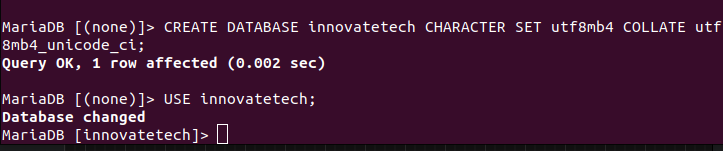

### 3.2 Creació de les taules

La base de dades consta de **15 taules** organitzades en 5 blocs funcionals.

**Bloc Personal i Organització**

```sql
CREATE TABLE departament (
  cod_dept INT PRIMARY KEY AUTO_INCREMENT,
  nom VARCHAR(100) NOT NULL,
  telefon VARCHAR(15)
);

CREATE TABLE empleat (
  dni VARCHAR(9) PRIMARY KEY,
  nom VARCHAR(50) NOT NULL,
  cognoms VARCHAR(100) NOT NULL,
  adreca VARCHAR(200),
  telefon VARCHAR(15),
  cod_dept INT NOT NULL,
  FOREIGN KEY (cod_dept) REFERENCES departament(cod_dept)
);

CREATE TABLE grup_nivell (
  id_nivell INT PRIMARY KEY AUTO_INCREMENT,
  nom VARCHAR(50) NOT NULL,
  salari_base DECIMAL(10,2) NOT NULL
);

CREATE TABLE nomines (
  id_nomina INT PRIMARY KEY AUTO_INCREMENT,
  dni VARCHAR(9) NOT NULL,
  id_nivell INT NOT NULL,
  data_pagament DATE NOT NULL,
  import DECIMAL(10,2) NOT NULL,
  FOREIGN KEY (dni) REFERENCES empleat(dni),
  FOREIGN KEY (id_nivell) REFERENCES grup_nivell(id_nivell)
);
```

**Bloc Comunicació Interna**

```sql
CREATE TABLE grup_qualitat (
  id_grup INT PRIMARY KEY AUTO_INCREMENT,
  nom ENUM('alta','mitja','baixa') NOT NULL,
  resolucio_video VARCHAR(20),
  bitrate_audio INT
);

CREATE TABLE usuari (
  id_usuari INT PRIMARY KEY AUTO_INCREMENT,
  nom_complet VARCHAR(150) NOT NULL,
  email VARCHAR(100) UNIQUE NOT NULL,
  extensio VARCHAR(10) UNIQUE,
  estat ENUM('actiu','bloquejat') DEFAULT 'actiu',
  tipus ENUM('intern','extern') NOT NULL,
  dni VARCHAR(9),
  id_grup INT,
  FOREIGN KEY (dni) REFERENCES empleat(dni),
  FOREIGN KEY (id_grup) REFERENCES grup_qualitat(id_grup)
);

CREATE TABLE trucada (
  id_trucada INT PRIMARY KEY AUTO_INCREMENT,
  id_originador INT NOT NULL,
  id_destinatari INT NOT NULL,
  inici DATETIME NOT NULL,
  fi DATETIME,
  duracio INT,
  qualitat ENUM('alta','mitja','baixa'),
  puntuacio TINYINT CHECK (puntuacio BETWEEN 1 AND 5),
  comentari TEXT,
  FOREIGN KEY (id_originador) REFERENCES usuari(id_usuari),
  FOREIGN KEY (id_destinatari) REFERENCES usuari(id_usuari)
);
```

**Bloc Contingut Multimèdia**

```sql
CREATE TABLE video (
  id_video INT PRIMARY KEY AUTO_INCREMENT,
  titol VARCHAR(200) NOT NULL,
  descripcio TEXT,
  categoria VARCHAR(50),
  duracio INT,
  data_publicacio DATE,
  enllac VARCHAR(500) NOT NULL
);

CREATE TABLE mesura_banda (
  id_mesura INT PRIMARY KEY AUTO_INCREMENT,
  data_hora DATETIME DEFAULT NOW(),
  id_operari INT NOT NULL,
  baixada DECIMAL(10,2),
  pujada DECIMAL(10,2),
  latencia DECIMAL(10,2),
  resultat ENUM('acceptable','no acceptable') NOT NULL,
  notes TEXT,
  FOREIGN KEY (id_operari) REFERENCES usuari(id_usuari)
);
```

**Bloc Vendes i Clients**

```sql
CREATE TABLE clients (
  id_client INT PRIMARY KEY AUTO_INCREMENT,
  nom VARCHAR(100) NOT NULL,
  cognoms VARCHAR(100),
  email VARCHAR(100) UNIQUE NOT NULL,
  telefon VARCHAR(15),
  adreca VARCHAR(200)
);

CREATE TABLE productes (
  id_producte INT PRIMARY KEY AUTO_INCREMENT,
  nom VARCHAR(100) NOT NULL,
  descripcio TEXT,
  preu DECIMAL(10,2) NOT NULL,
  estoc INT DEFAULT 0
);

CREATE TABLE comandes (
  id_comanda INT PRIMARY KEY AUTO_INCREMENT,
  id_client INT NOT NULL,
  data_comanda DATETIME DEFAULT NOW(),
  estat ENUM('pendent','enviada','entregada','cancel·lada') NOT NULL,
  total DECIMAL(10,2),
  FOREIGN KEY (id_client) REFERENCES clients(id_client)
);

CREATE TABLE cistell (
  id_cistell INT PRIMARY KEY AUTO_INCREMENT,
  id_client INT NOT NULL,
  id_producte INT NOT NULL,
  quantitat INT NOT NULL DEFAULT 1,
  data_afegit DATETIME DEFAULT NOW(),
  FOREIGN KEY (id_client) REFERENCES clients(id_client),
  FOREIGN KEY (id_producte) REFERENCES productes(id_producte)
);
```

**Bloc Auditoria i Sistema**

```sql
CREATE TABLE avisos (
  id_avis INT PRIMARY KEY AUTO_INCREMENT,
  usuari_bd VARCHAR(100),
  taula_afectada VARCHAR(100),
  operacio VARCHAR(50),
  data_hora DATETIME DEFAULT NOW(),
  detall TEXT
);

CREATE TABLE control_backup (
  id_backup INT PRIMARY KEY AUTO_INCREMENT,
  data_hora DATETIME DEFAULT NOW(),
  taules_incloses TEXT,
  resultat ENUM('ok','error') NOT NULL
);
```

> 📸 **CAPTURA**: Posar aquí la captura del `SHOW TABLES` amb les 15 taules
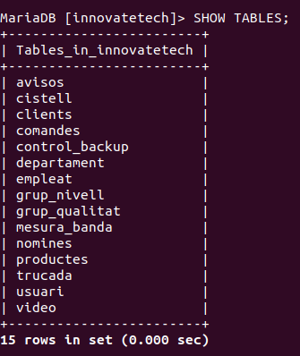

### 3.3 Verificació de l'estructura de les taules

```sql
DESCRIBE empleat;
DESCRIBE usuari;
DESCRIBE trucada;
```

> 📸 **CAPTURA**: Posar aquí la captura dels DESCRIBE
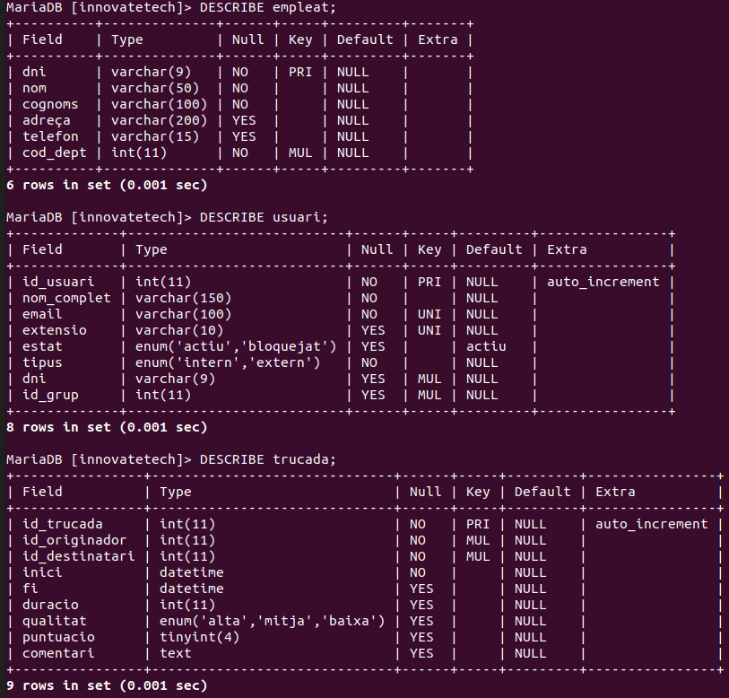

### 3.4 Dades de prova

S'han inserit dades de prova a totes les taules per verificar el correcte funcionament de les relacions i les restriccions. Les dades simulen un entorn empresarial real amb empleats dels quatre departaments de l'empresa, clients externs, productes tecnològics i registres de trucades i mesures de banda.

### 3.5 Inserció de les dades

```sql
INSERT INTO departament (nom, telefon) VALUES
('Vendes', '932001001'),
('Suport Tècnic', '932001002'),
('Administració', '932001003'),
('Logística', '932001004');

INSERT INTO grup_nivell (nom, salari_base) VALUES
('Junior', 1500.00),
('Senior', 2500.00),
('Manager', 3500.00),
('Director', 5000.00);

INSERT INTO empleat (dni, nom, cognoms, adreca, telefon, cod_dept) VALUES
('12345678A', 'Joan', 'Garcia López', 'Carrer Major 1, Barcelona', '600111222', 1),
('87654321B', 'Maria', 'Pérez Ruiz', 'Av. Diagonal 5, Barcelona', '600333444', 2),
('11223344C', 'Pere', 'Martínez Gil', 'Passeig Gràcia 10, Barcelona', '600555666', 3),
('44332211D', 'Anna', 'López Fernández', 'Carrer Aragó 20, Barcelona', '600777888', 4),
('55443322E', 'Lluís', 'Sánchez Torres', 'Gran Via 30, Barcelona', '600999000', 1);

INSERT INTO grup_qualitat (nom, resolucio_video, bitrate_audio) VALUES
('alta', '1080p', 320),
('mitja', '720p', 192),
('baixa', '480p', 96);

INSERT INTO usuari (nom_complet, email, extensio, estat, tipus, dni, id_grup) VALUES
('Joan Garcia López', 'joan@innovatetech.com', '101', 'actiu', 'intern', '12345678A', 1),
('Maria Pérez Ruiz', 'maria@innovatetech.com', '102', 'actiu', 'intern', '87654321B', 2),
('Pere Martínez Gil', 'pere@innovatetech.com', '103', 'actiu', 'intern', '11223344C', 1),
('Anna López Fernández', 'anna@innovatetech.com', '104', 'bloquejat', 'intern', '44332211D', 3),
('Lluís Sánchez Torres', 'lluis@innovatetech.com', '105', 'actiu', 'intern', '55443322E', 2),
('Client Extern 1', 'client1@gmail.com', NULL, 'actiu', 'extern', NULL, 3),
('Client Extern 2', 'client2@gmail.com', NULL, 'actiu', 'extern', NULL, 3);

INSERT INTO nomines (dni, id_nivell, data_pagament, import) VALUES
('12345678A', 2, '2026-05-01', 2500.00),
('87654321B', 1, '2026-05-01', 1500.00),
('11223344C', 3, '2026-05-01', 3500.00),
('44332211D', 1, '2026-05-01', 1500.00),
('55443322E', 2, '2026-05-01', 2500.00);

INSERT INTO trucada (id_originador, id_destinatari, inici, fi, duracio, qualitat, puntuacio, comentari) VALUES
(1, 2, '2026-05-01 10:00:00', '2026-05-01 10:30:00', 30, 'alta', 5, 'Molt bona qualitat'),
(2, 3, '2026-05-02 11:00:00', '2026-05-02 11:15:00', 15, 'mitja', 4, 'Correcte'),
(3, 1, '2026-05-03 09:00:00', '2026-05-03 09:45:00', 45, 'alta', 5, NULL),
(1, 6, '2026-05-04 12:00:00', '2026-05-04 12:20:00', 20, 'baixa', 3, 'Qualitat acceptable'),
(5, 7, '2026-05-05 15:00:00', '2026-05-05 15:10:00', 10, 'mitja', 4, NULL);

INSERT INTO video (titol, descripcio, categoria, duracio, data_publicacio, enllac) VALUES
('Introducció a la xarxa', 'Curs bàsic de xarxes', 'formació', 3600, '2026-01-10', 'http://streaming.innovatetech.com/video1.mp4'),
('Seguretat informàtica', 'Bones pràctiques de seguretat', 'seguretat', 5400, '2026-02-15', 'http://streaming.innovatetech.com/video2.mp4'),
('Configuració de servidors', 'Guia de configuració AWS', 'tècnic', 7200, '2026-03-20', 'http://streaming.innovatetech.com/video3.mp4'),
('Gestió de bases de dades', 'MariaDB per a administradors', 'formació', 4800, '2026-04-01', 'http://streaming.innovatetech.com/video4.mp4');

INSERT INTO clients (nom, cognoms, email, telefon, adreca) VALUES
('Carlos', 'Rodríguez Pérez', 'carlos@gmail.com', '611222333', 'Carrer Nou 5, Barcelona'),
('Laura', 'Gómez Martín', 'laura@gmail.com', '622333444', 'Av. Meridiana 10, Barcelona'),
('Sergio', 'Fernández López', 'sergio@gmail.com', '633444555', 'Carrer Balmes 20, Barcelona');

INSERT INTO productes (nom, descripcio, preu, estoc) VALUES
('Servidor Dell R740', 'Servidor rack 2U', 3500.00, 10),
('Switch Cisco 24p', 'Switch gestionable 24 ports', 800.00, 15),
('Llicència Windows Server', 'Llicència anual', 500.00, 50),
('Servei de suport tècnic', 'Suport mensual', 200.00, 100);

INSERT INTO comandes (id_client, estat, total) VALUES
(1, 'entregada', 3500.00),
(2, 'pendent', 800.00),
(3, 'enviada', 700.00);

INSERT INTO cistell (id_client, id_producte, quantitat) VALUES
(1, 1, 1),
(2, 2, 2),
(3, 3, 1),
(1, 4, 3);

INSERT INTO mesura_banda (id_operari, baixada, pujada, latencia, resultat, notes) VALUES
(1, 150.50, 80.25, 12.30, 'acceptable', 'Mesura matinal'),
(2, 95.30, 45.10, 25.60, 'acceptable', 'Mesura tarda'),
(3, 30.20, 15.50, 85.20, 'no acceptable', 'Latència molt alta'),
(1, 200.00, 100.00, 8.50, 'acceptable', 'Mesura nit');

INSERT INTO avisos (usuari_bd, taula_afectada, operacio, detall) VALUES
('joan@innovatetech.com', 'empleat', 'UPDATE', 'Intent de modificació no autoritzat'),
('lluis@innovatetech.com', 'trucada', 'INSERT', 'Quota diària assolida');

INSERT INTO control_backup (taules_incloses, resultat) VALUES
('empleat, usuari, trucada', 'ok'),
('empleat, usuari, trucada, video', 'ok');
```

Verificació de les dades inserides:

```sql
SELECT * FROM departament;
SELECT * FROM empleat;
SELECT * FROM usuari;
SELECT * FROM trucada;
SELECT * FROM video;
SELECT * FROM mesura_banda;
```

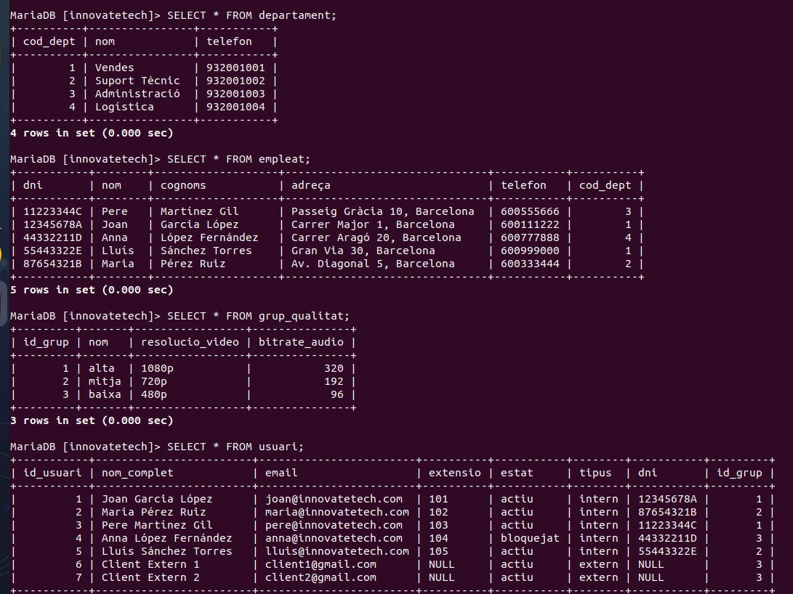

---

## 4. Creació de Rols i Permisos

### 4.1 Creació dels rols

S'han creat 4 rols seguint les indicacions del document del projecte:

```sql
CREATE ROLE 'admin';
CREATE ROLE 'vendes';
CREATE ROLE 'administracio';
CREATE ROLE 'treballador';
```


### 4.2 Assignació de permisos

**Rol admin** — Accés total a totes les taules i permisos especials de fitxers:

```sql
GRANT ALL PRIVILEGES ON innovatetech.* TO 'admin';
GRANT FILE ON *.* TO 'admin';
```


**Rol vendes** — Pot gestionar clients, comandes, productes, cistell i trucades:

```sql
GRANT SELECT, INSERT, UPDATE ON innovatetech.clients TO 'vendes';
GRANT SELECT, INSERT, UPDATE ON innovatetech.comandes TO 'vendes';
GRANT SELECT, INSERT, UPDATE ON innovatetech.productes TO 'vendes';
GRANT SELECT, INSERT, UPDATE ON innovatetech.cistell TO 'vendes';
GRANT SELECT, INSERT, UPDATE ON innovatetech.trucada TO 'vendes';
```


**Rol administracio** — Pot gestionar personal, nòmines i departaments. No pot accedir al sistema de trucades de clients:

```sql
GRANT SELECT, INSERT, UPDATE ON innovatetech.empleat TO 'administracio';
GRANT SELECT, INSERT, UPDATE ON innovatetech.nomines TO 'administracio';
GRANT SELECT, INSERT, UPDATE ON innovatetech.departament TO 'administracio';
GRANT SELECT, INSERT, UPDATE ON innovatetech.grup_nivell TO 'administracio';
```


**Rol treballador** — Pot consultar productes, vídeos i configuració. Pot registrar trucades pròpies. No pot modificar dades de personal ni clients:

```sql
GRANT SELECT ON innovatetech.productes TO 'treballador';
GRANT SELECT ON innovatetech.video TO 'treballador';
GRANT SELECT ON innovatetech.grup_qualitat TO 'treballador';
GRANT INSERT ON innovatetech.trucada TO 'treballador';
```


---

## 5. Script de Creació Automatitzada d'Usuaris

### 5.1 Descripció general

El script `crear_usuari.sh` és un script en Bash que automatitza la creació d'usuaris a la base de dades MariaDB d'InnovateTech. L'objectiu és simplificar la tasca de l'administrador, evitar errors manuals i garantir que cada usuari té el rol correcte assignat des del primer moment.

### 5.2 Com funciona pas a pas

**1. Demana les dades a l'administrador**
El script demana de forma interactiva el nom d'usuari, la contrasenya, el rol i el host. Si no s'especifica host, agafa `localhost` per defecte.

**2. Valida el rol**
Comprova que el rol introduït és un dels quatre rols vàlids del sistema: `admin`, `vendes`, `administracio` o `treballador`. Si el rol no existeix, el script atura l'execució i mostra un error.

**3. Comprova si l'usuari ja existeix**
Abans de crear l'usuari, consulta la taula `mysql.user` per comprovar si ja existeix un usuari amb el mateix nom i host. Si ja existeix, el script atura l'execució i avisa l'administrador.

**4. Crea l'usuari i assigna el rol**
Si totes les validacions són correctes, executa les següents sentències SQL:
- `CREATE USER` — crea l'usuari amb la contrasenya
- `GRANT rol TO usuari` — assigna el rol corresponent
- `SET DEFAULT ROLE` — estableix el rol per defecte
- `FLUSH PRIVILEGES` — aplica els canvis immediatament

**5. Genera el fitxer .sql**
Totes les sentències SQL executades es guarden al fitxer `usuaris_creats.sql` perquè l'administrador pugui revisar-les o executar-les posteriorment en un altre servidor.

### 5.3 Codi del script

```bash
#!/bin/bash

DB_USER="root"
DB_PASS="la_teva_contrasenya"
DB_NAME="innovatetech"
OUTPUT_FILE="usuaris_creats.sql"
ROLS_VALIDS=("admin" "vendes" "administracio" "treballador")

echo "=== Creació d'usuaris InnovateTech ==="
read -p "Nom d'usuari MySQL: " NOM
read -s -p "Contrasenya: " PASS
echo ""
read -p "Rol (admin/vendes/administracio/treballador): " ROL
read -p "Host (default: localhost): " HOST
HOST=${HOST:-localhost}

# Validar rol
ROL_VALID=false
for r in "${ROLS_VALIDS[@]}"; do
  if [ "$r" == "$ROL" ]; then ROL_VALID=true; fi
done

if [ "$ROL_VALID" == "false" ]; then
  echo "Rol no vàlid. Rols acceptats: admin, vendes, administracio, treballador"
  exit 1
fi

# Comprovar si ja existeix
EXISTEIX=$(mysql -u$DB_USER -p$DB_PASS -se \
  "SELECT COUNT(*) FROM mysql.user WHERE user='$NOM' AND host='$HOST';" 2>/dev/null)

if [ "$EXISTEIX" -gt 0 ]; then
  echo "L'usuari '$NOM'@'$HOST' ja existeix."
  exit 1
fi

# Generar SQL
SQL="CREATE USER '$NOM'@'$HOST' IDENTIFIED BY '$PASS';\n\
GRANT '$ROL' TO '$NOM'@'$HOST';\n\
SET DEFAULT ROLE '$ROL' FOR '$NOM'@'$HOST';\n\
FLUSH PRIVILEGES;"

# Executar
echo -e "$SQL" | mysql -u$DB_USER -p$DB_PASS 2>/dev/null
if [ $? -eq 0 ]; then
  echo "Usuari '$NOM' creat amb rol '$ROL'"
  echo -e "$SQL" >> $OUTPUT_FILE
  echo "SQL guardat a $OUTPUT_FILE"
else
  echo "Error en crear l'usuari"
fi
```

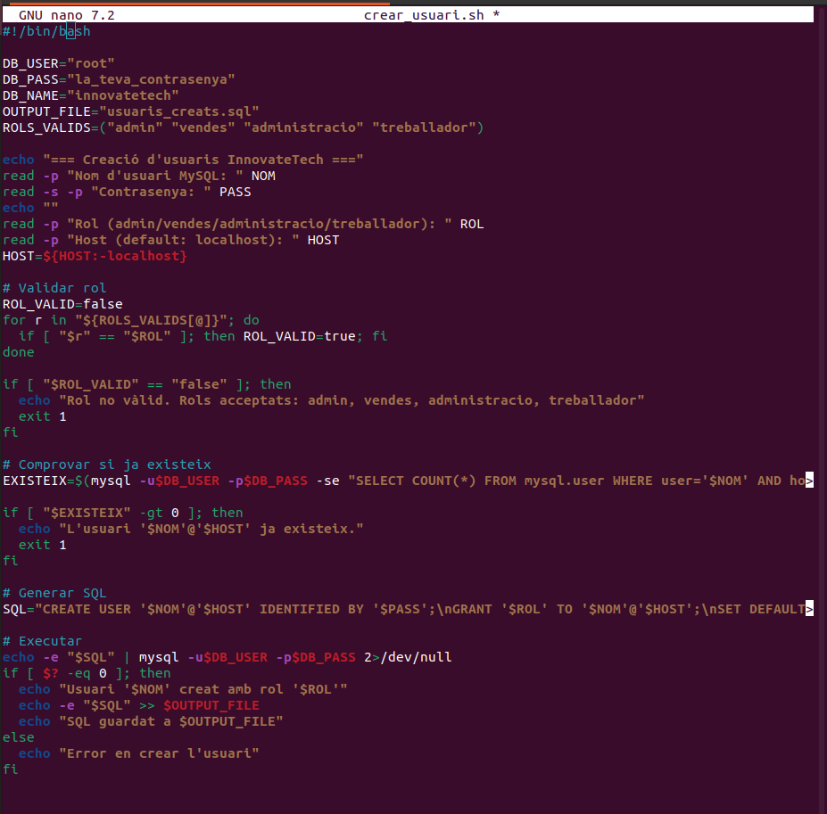

### 5.4 Comprovació

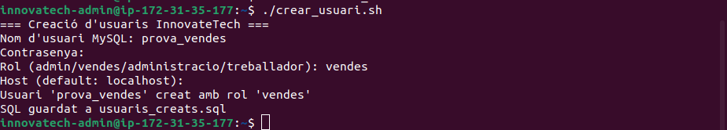

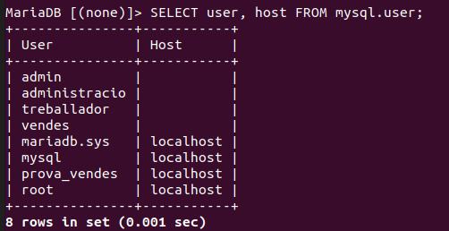

---

## 6. Triggers de Control i Auditoria

S'han implementat **5 triggers** que donen suport a la seguretat i auditoria de la base de dades. Tots els triggers s'executen **abans** de la inserció o modificació (`BEFORE`) per poder bloquejar l'operació si cal.

---

### 6.1 Trigger — Quota diària de trucades

**Nom:** `check_quota_diaria`
**S'activa:** `BEFORE INSERT ON trucada`

Comprova quantes trucades ha fet l'usuari originador durant el dia actual. Si ha superat les 20 trucades, bloqueja la inserció i registra un avís a la taula `avisos`.

**Justificació:** Un límit de 20 trucades diàries és suficient per a un ús empresarial normal. Evita un ús abusiu del sistema de comunicació intern.

```sql
DELIMITER $$
CREATE TRIGGER check_quota_diaria
BEFORE INSERT ON trucada
FOR EACH ROW
BEGIN
  DECLARE total_dia INT;
  SELECT COUNT(*) INTO total_dia
  FROM trucada
  WHERE id_originador = NEW.id_originador
    AND DATE(inici) = DATE(NOW());

  IF total_dia >= 20 THEN
    INSERT INTO avisos (usuari_bd, taula_afectada, operacio, detall)
    VALUES (USER(), 'trucada', 'INSERT',
      CONCAT('Quota diaria assolida per usuari ', NEW.id_originador));
    SIGNAL SQLSTATE '45000'
      SET MESSAGE_TEXT = 'Quota diaria de trucades assolida';
  END IF;
END$$
DELIMITER ;
```

**Comprovació:** S'intenta inserir més de 20 trucades en un dia amb el mateix usuari. El trigger bloqueja la inserció i retorna un error.

```sql
INSERT INTO trucada (id_originador, id_destinatari, inici, fi, duracio, qualitat)
VALUES (2, 3, NOW(), NOW(), 1, 'alta');
-- Repetit 21 vegades fins que surt l'error
```

> 📸 **CAPTURA**: Error `Quota diaria de trucades assolida`

---

### 6.2 Trigger — Quota mensual de trucades

**Nom:** `check_quota_mensual`
**S'activa:** `BEFORE INSERT ON trucada`

El trigger funciona així:
1. Quan algú intenta inserir una nova trucada a la taula `trucada`
2. El trigger agafa l'`id_originador` (qui truca) → `NEW.id_originador`
3. Fa un `SUM(duracio)` de totes les trucades d'aquell usuari del mes actual
4. Si la suma supera **600 minuts** (10 hores) → bloqueja la trucada i guarda un avís a `avisos`
5. Si no supera → deixa inserir normalment

El `COALESCE` serveix per si l'usuari no té cap trucada encara, retorna 0 en lloc de NULL.

**Justificació:** S'ha establert un límit de 600 minuts mensuals per usuari, equivalent a 10 hores de trucades al mes, valor considerat suficient per a un ús empresarial normal.

```sql
DELIMITER $$
CREATE TRIGGER check_quota_mensual
BEFORE INSERT ON trucada
FOR EACH ROW
BEGIN
  DECLARE total_minuts INT;
  SELECT COALESCE(SUM(duracio), 0) INTO total_minuts
  FROM trucada
  WHERE id_originador = NEW.id_originador
    AND MONTH(inici) = MONTH(NOW())
    AND YEAR(inici) = YEAR(NOW());

  IF total_minuts >= 600 THEN
    INSERT INTO avisos (usuari_bd, taula_afectada, operacio, detall)
    VALUES (USER(), 'trucada', 'INSERT',
      CONCAT('Quota mensual assolida per usuari ', NEW.id_originador));
    SIGNAL SQLSTATE '45000'
      SET MESSAGE_TEXT = 'Quota mensual de trucades assolida';
  END IF;
END$$
DELIMITER ;
```

**Comprovació:** S'intenta inserir una trucada de 99999 minuts per superar el límit mensual. El trigger bloqueja la inserció i retorna un error.

```sql
INSERT INTO trucada (id_originador, id_destinatari, inici, fi, duracio, qualitat)
VALUES (1, 2, NOW(), NOW(), 99999, 'alta');
```

> 📸 **CAPTURA**: Error `Quota mensual de trucades assolida`

---

### 6.3 Trigger — Bloqueig d'usuaris

**Nom:** `check_usuari_bloquejat`
**S'activa:** `BEFORE INSERT ON trucada`

Comprova l'estat de l'usuari originador i del destinatari. Si qualsevol dels dos està en estat `bloquejat`, impedeix la trucada. El bloqueig pot ser temporal o indefinit modificant el camp `estat` de la taula `usuari`.

Permet a l'administrador bloquejar usuaris de forma immediata sense haver d'eliminar-los del sistema, mantenint l'historial de trucades intacte.

```sql
DELIMITER $$
CREATE TRIGGER check_usuari_bloquejat
BEFORE INSERT ON trucada
FOR EACH ROW
BEGIN
  DECLARE estat_orig VARCHAR(20);
  DECLARE estat_dest VARCHAR(20);

  SELECT estat INTO estat_orig
    FROM usuari WHERE id_usuari = NEW.id_originador;
  SELECT estat INTO estat_dest
    FROM usuari WHERE id_usuari = NEW.id_destinatari;

  IF estat_orig = 'bloquejat' THEN
    SIGNAL SQLSTATE '45000'
      SET MESSAGE_TEXT = 'Usuari originador bloquejat';
  END IF;

  IF estat_dest = 'bloquejat' THEN
    SIGNAL SQLSTATE '45000'
      SET MESSAGE_TEXT = 'Usuari destinatari bloquejat';
  END IF;
END$$
DELIMITER ;
```

**Comprovació:** S'intenta inserir una trucada amb l'usuari Anna (id=4) que té estat `bloquejat`. El trigger bloqueja la inserció i retorna un error.

```sql
INSERT INTO trucada (id_originador, id_destinatari, inici, fi, duracio, qualitat)
VALUES (4, 1, NOW(), NOW(), 10, 'alta');
```

> 📸 **CAPTURA**: Error `Usuari originador bloquejat`

---

### 6.4 Trigger — Auditoria per a treballador/vendes

**Nom:** `audit_nomines_update`
**S'activa:** `BEFORE UPDATE ON nomines`

Quan un usuari intenta modificar la taula `nomines`, el trigger comprova quin rol té l'usuari connectat en aquell moment mitjançant la funció `USER()` i la consulta a `information_schema.APPLICABLE_ROLES`. Si l'usuari té rol `treballador` o `vendes`, el trigger realitza dues accions:

Primer registra l'intent a la taula `avisos` amb la informació de l'usuari, la taula afectada, l'operació intentada i la data i hora. Després bloqueja l'operació llançant un error mitjançant `SIGNAL SQLSTATE`, impedint que la modificació s'executi.

Els rols `treballador` i `vendes` no tenen permisos sobre dades sensibles com les nòmines dels empleats. Aquest trigger afegeix una capa extra de seguretat i auditoria per detectar i registrar possibles intents d'accés no autoritzat, complint amb les normatives de protecció de dades.

```sql
DELIMITER $$
CREATE TRIGGER audit_nomines_update
BEFORE UPDATE ON nomines
FOR EACH ROW
BEGIN
  DECLARE rol_usuari VARCHAR(50);
  SELECT DEFAULT_ROLE_NAME INTO rol_usuari
  FROM information_schema.APPLICABLE_ROLES
  WHERE GRANTEE = USER() LIMIT 1;

  IF rol_usuari IN ('treballador', 'vendes') THEN
    INSERT INTO avisos (usuari_bd, taula_afectada, operacio, detall)
    VALUES (USER(), 'nomines', 'UPDATE',
      'Intent de modificació no autoritzat a nomines');
    SIGNAL SQLSTATE '45000'
      SET MESSAGE_TEXT = 'Acces no autoritzat a taula nomines';
  END IF;
END$$
DELIMITER ;
```

**Comprovació:** La comprovació d'aquest trigger queda evidenciada a la taula `avisos`. Quan un usuari amb rol `vendes` intenta modificar `nomines`, MariaDB ja ho bloqueja a nivell de permisos de rol, afegint una capa extra de seguretat.

```sql
SELECT * FROM avisos;
```

> 📸 **CAPTURA**: `SELECT * FROM avisos` mostrant els registres d'auditoria

---

### 6.5 Trigger — Auditoria pel rol administracio

**Nom:** `audit_administracio_trucades`
**S'activa:** `BEFORE UPDATE ON trucada`

Quan un usuari intenta modificar la taula `trucada`, el trigger comprova quin rol té l'usuari connectat mitjançant `USER()` i la consulta a `information_schema.APPLICABLE_ROLES`. Si l'usuari té rol `administracio`, el trigger realitza dues accions:

Primer registra l'intent a la taula `avisos` amb la informació de l'usuari, la taula afectada, l'operació intentada i la data i hora. Després bloqueja l'operació llançant un error mitjançant `SIGNAL SQLSTATE`, impedint que la modificació s'executi.

El rol `administracio` gestiona dades de personal i nòmines però no hauria de poder accedir ni modificar les trucades dels clients, ja que són dades confidencials del sistema de comunicació. Aquest trigger garanteix la separació de responsabilitats entre departaments.

```sql
DELIMITER $$
CREATE TRIGGER audit_administracio_trucades
BEFORE UPDATE ON trucada
FOR EACH ROW
BEGIN
  DECLARE rol_usuari VARCHAR(50);
  SELECT DEFAULT_ROLE_NAME INTO rol_usuari
  FROM information_schema.APPLICABLE_ROLES
  WHERE GRANTEE = USER() LIMIT 1;

  IF rol_usuari = 'administracio' THEN
    INSERT INTO avisos (usuari_bd, taula_afectada, operacio, detall)
    VALUES (USER(), 'trucada', 'UPDATE',
      'Intent daccés no autoritzat a trucades per rol administracio');
    SIGNAL SQLSTATE '45000'
      SET MESSAGE_TEXT = 'Acces no autoritzat a taula trucada';
  END IF;
END$$
DELIMITER ;
```

**Comprovació:** De la mateixa manera que el trigger anterior, queda evidenciat a la taula `avisos`. El sistema de doble protecció (permisos + trigger) garanteix que cap accés no autoritzat passi desapercebut.

```sql
SELECT * FROM avisos;
```

> 📸 **CAPTURA**: `SELECT * FROM avisos` mostrant tots els registres d'auditoria

---

### 6.6 Verificació de tots els triggers

```sql
SHOW TRIGGERS;
```

> 📸 **CAPTURA**: `SHOW TRIGGERS` mostrant els 5 triggers creats i actius

> 📸 **CAPTURA**: Posar aquí la captura del SHOW TRIGGERS amb els 5 triggers

---

## 7. Event Periòdic de Backup

### 7.1 Justificació de la periodicitat

S'ha escollit una periodicitat **diària** amb execució a les **02:00h** perquè:
- És l'hora de menor activitat del sistema, minimitzant l'impacte en el rendiment
- Les dades de trucades, comandes i empleats canvien diàriament, per tant un backup setmanal podria suposar una pèrdua de dades significativa
- En cas d'incident, la pèrdua màxima de dades seria d'un dia (RPO de 24h)
- És una pràctica estàndard en entorns empresarials per a bases de dades de gestió

### 7.2 Creació del directori de backup

```bash
sudo mkdir -p /var/lib/mysql/backup
sudo chown mysql:mysql /var/lib/mysql/backup
```

> 📸 **CAPTURA**: Posar aquí la captura de la creació del directori

### 7.3 Activació de l'event scheduler

```sql
SET GLOBAL event_scheduler = ON;
```

> 📸 **CAPTURA**: Posar aquí la captura de l'activació de l'event scheduler

### 7.4 Creació de l'event

L'event `backup_diari` s'executa automàticament cada dia a les 02:00h i realitza una còpia de seguretat de les taules crítiques de la base de dades d'InnovateTech. Utilitza la sentència `SELECT ... INTO OUTFILE` per exportar les dades en format CSV al directori `/var/lib/mysql/backup/`.

```sql
DELIMITER $$
CREATE EVENT backup_diari
ON SCHEDULE EVERY 1 DAY
STARTS '2026-05-21 02:00:00'
DO
BEGIN
  SELECT * INTO OUTFILE '/var/lib/mysql/backup/empleats.csv'
  FIELDS TERMINATED BY ',' ENCLOSED BY '"' LINES TERMINATED BY '\n'
  FROM empleat;

  SELECT * INTO OUTFILE '/var/lib/mysql/backup/clients.csv'
  FIELDS TERMINATED BY ',' ENCLOSED BY '"' LINES TERMINATED BY '\n'
  FROM clients;

  SELECT * INTO OUTFILE '/var/lib/mysql/backup/comandes.csv'
  FIELDS TERMINATED BY ',' ENCLOSED BY '"' LINES TERMINATED BY '\n'
  FROM comandes;

  SELECT * INTO OUTFILE '/var/lib/mysql/backup/trucades.csv'
  FIELDS TERMINATED BY ',' ENCLOSED BY '"' LINES TERMINATED BY '\n'
  FROM trucada;

  INSERT INTO control_backup (taules_incloses, resultat)
  VALUES ('empleat, clients, comandes, trucada', 'ok');
END$$
DELIMITER ;
```

> 📸 **CAPTURA**: Posar aquí la captura de la creació de l'event

### 7.5 Taules incloses al backup

- `empleat` — dades del personal de l'empresa
- `clients` — dades dels clients externs
- `comandes` — registre de totes les comandes
- `trucada` — registre d'activitat de trucades

Cada vegada que l'event s'executa correctament, insereix un registre a la taula `control_backup` amb la data, hora, taules incloses i resultat. Això permet a l'administrador verificar que els backups s'estan realitzant correctament.

### 7.6 Verificació

```sql
SHOW EVENTS;
```

> 📸 **CAPTURA**: Posar aquí la captura del SHOW EVENTS mostrant backup_diari ENABLED
